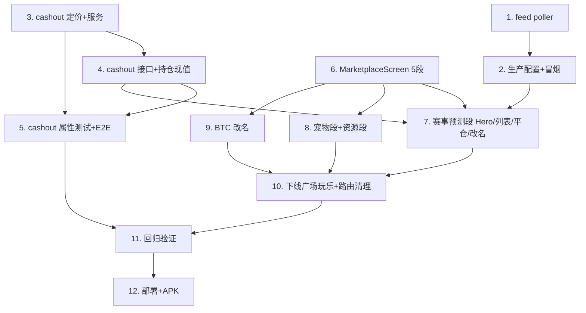

# Implementation Plan — Agentrix 集市 Tab 重构

## Overview
四阶段：A 接通赔率源（最快见效）→ B 平仓后端 → C 移动端集市单层重构 + 赛事列表/Hero/改名 → D 路由清理 + 验证 + 部署。每阶段独立可验证。后端先行（A/B），前端随后（C），收尾（D）。

## Tasks

### 阶段 A — 接通赔率源（盘口非空）★最快见效

- [x] 1. LSM feed poller（从 KMarket 拉取赔率）
  - 新增 `LsmFeedPoller`（@Cron，复用全局 ScheduleModule）：live 每 30s / 全量每 5min，GET KMarket `/api/v1/internal/lsm/snapshots`（`X-Internal-Token`）→ `LsmFeedService.ingest`；env `KMARKET_INTERNAL_BASE_URL`/`KMARKET_INTERNAL_TOKEN`/`LSM_FEED_POLL_DISABLED`；超时+try/catch+告警，未配置 env 静默跳过。注册进 `lsm.module.ts`。
  - _Requirements: 3.1, 3.2, 3.5_

- [x] 2. 生产配置 + 端到端冒烟（赔率流通）
  - 生产 env 配 KMarket 内部端点 + token；验证 Agentrix 落库出现世界杯盘口、`markets/live` 返回非空、stale 判定正确、`sweepSettlements` 能据 winningOutcomeIdx 结算。
  - _Requirements: 3.3, 3.4_

### 阶段 B — 平仓 cash-out（后端）

- [x] 3. cash-out 定价纯函数 + 服务
  - `lsm.pricing.ts` 新增 `computeCashout`（按当前可成交赔率 mark-to-market：`maxProfit_now=floor(N·(o_e/o_c−1))`，`cashout=clamp(M+maxProfit_now,0,M+maxProfit)`，全整数）。`LsmOrderService.cashOut(orderId,userId)`：取现价→定价→逐金库腿释放预留 + 结算（splitProRata 拆 cashout，余数归官方腿，强校验 Σcashout≤Σreserve）→ 订单 `CASHED_OUT` + 用户 credit（幂等 `lsm:cashout:<id>`）；门禁 tradable + `systemMode.assertCanOpen()`。
  - _Requirements: 6.2, 6.3, 6.4, 8.1_

- [x] 4. cash-out 接口 + 持仓现值
  - `POST /lsm/orders/:id/cashout`（JwtAuthGuard）。`myOrders`/持仓视图为每个 OPEN 单附实时 `cashoutValue`。RN/web API 客户端补 `cashOut()`。
  - _Requirements: 6.1, 6.5_

- [x] 5. cash-out 属性测试 + E2E 扩展
  - `lsm.properties.spec.ts` 加 P-cashout-1..4（兑现≤预留和/守恒/偿付/隔离/全整数）；`lsm.e2e.spec.ts` 加「开仓→价变→平仓→守恒」。
  - _Requirements: 8.1, 8.2_

### 阶段 C — 移动端集市单层重构

- [x] 6. MarketplaceScreen（5 段单层 root）
  - 由 `ClawMarketplaceScreen` 升级为 5 段：赛事预测(默认)/OpenClaw技能/任务/宠物/资源与商品；同屏 state 切换；迁移 PlazaScreen 顶栏有用部分（AXP pill/搜索/通知）。`PlazaStack.PlazaRoot` 指向它，删 `PlazaScreen`。
  - _Requirements: 1.1, 1.2, 1.4_

- [x] 7. 赛事预测段升级（Hero + 列表 + 持仓平仓 + 改名）
  - `LeverageSportsMarketScreen` → 赛事预测段：盘口页加 **WorldCupHero**（大图 banner，`/lsm/markets/featured` 或按 league 过滤）+ 赛事分组列表（live→pre→settled），赔率点按直接开 `OrderTicket`；持仓页加实时 `cashoutValue` + 「平仓」按钮（二次确认→`cashOut`）；全文案「杠杆滚球」→「赛事预测」。
  - _Requirements: 4.1, 4.2, 4.3, 4.4, 5.1, 5.2, 5.3, 5.4, 6.1, 7.1_

- [x] 8. 宠物段 + 资源段
  - 宠物段接入皮肤市场（`SkinAuctionScreen`/`market/skins`/`FeaturedSkinsCarousel`）；资源段沿用 `ResourcesTab`（去/弱化 TEST 横幅）。
  - _Requirements: 1.2_

- [x] 9. BTC 预测改名
  - 既有 BTC 5min `Predict` 屏标题/入口文案 → 「BTC 预测」（消歧义）。
  - _Requirements: 7.2_

### 阶段 D — 路由清理 + 验证 + 部署

- [x] 10. 下线广场/玩乐 + 路由清理（无死链）
  - 删除集市内 广场(Feed/Messaging/GreetingCard*)、玩乐(EventsCenter/PhotoMimic/Predict 入口/CoRaising*) 的入口；逐个核查跨 Tab 复用，仅去集市入口、保留被复用屏；清 `PlazaStackNavigator` 注册 + `PlazaStackParamList` + 所有 `navigate('<删>')` + `resolveLegacyRoute` 深链别名（导向 MarketplaceRoot 或保留屏）。
  - _Requirements: 2.1, 2.2, 2.3, 2.4_

- [x] 11. 回归验证
  - `tsc --noEmit` 0 新错误；全局 grep 无悬空 `navigate()`；LSM 既有测试 + 新增 cashout 测试全过；移动端冒烟（集市 5 段切换、赛事列表有数据、开仓、平仓、改名生效）。
  - _Requirements: 8.2, 8.3_

- [-] 12. 部署 + APK
  - 后端 SSH deploy（build + 无新 migration + pm2 restart + 健康检查）+ 生产 env（KMarket 内部端点）；移动端推镜像触发 APK；验证生产赛事列表非空、可开/平仓。
  - _Requirements: 8.3, 3.x_

## Task Dependency Graph



```json
{ "waves": [
  { "wave": 1, "tasks": ["1","2"] },
  { "wave": 2, "tasks": ["3","4","5"] },
  { "wave": 3, "tasks": ["6","7","8","9"] },
  { "wave": 4, "tasks": ["10","11","12"] }
] }
```

## Notes
- 阶段 A 可独立先行上线，让世界杯盘口立刻有数据（不依赖前端重构）。
- 后端模块/表/路径 `lsm` 不改名，仅前端展示「赛事预测」；BTC 那个改「BTC 预测」。
- cash-out 先 `LSM_CASHOUT_EDGE_BPS=0` 保守不抽退出 edge；floor 取整 + 兑现≤预留强校验守住金库。
- 删路由前必须逐个 grep 引用方，避免误删跨 Tab（世界/我）复用的底层屏。
