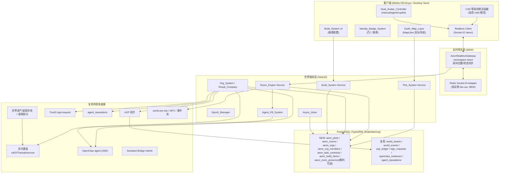
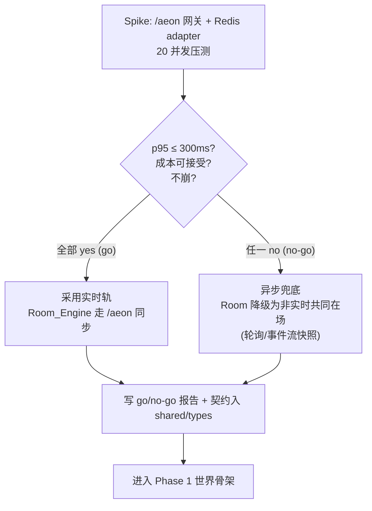
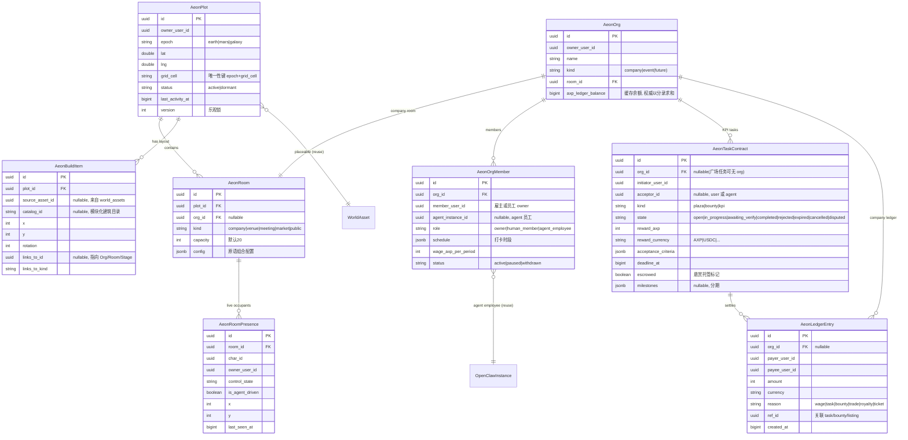
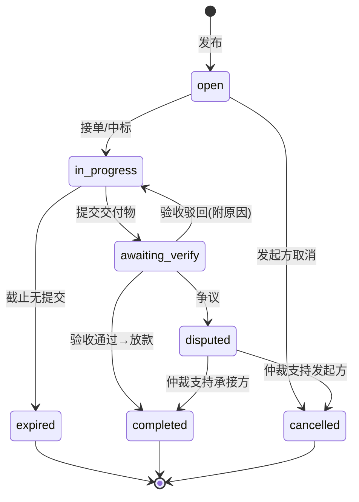
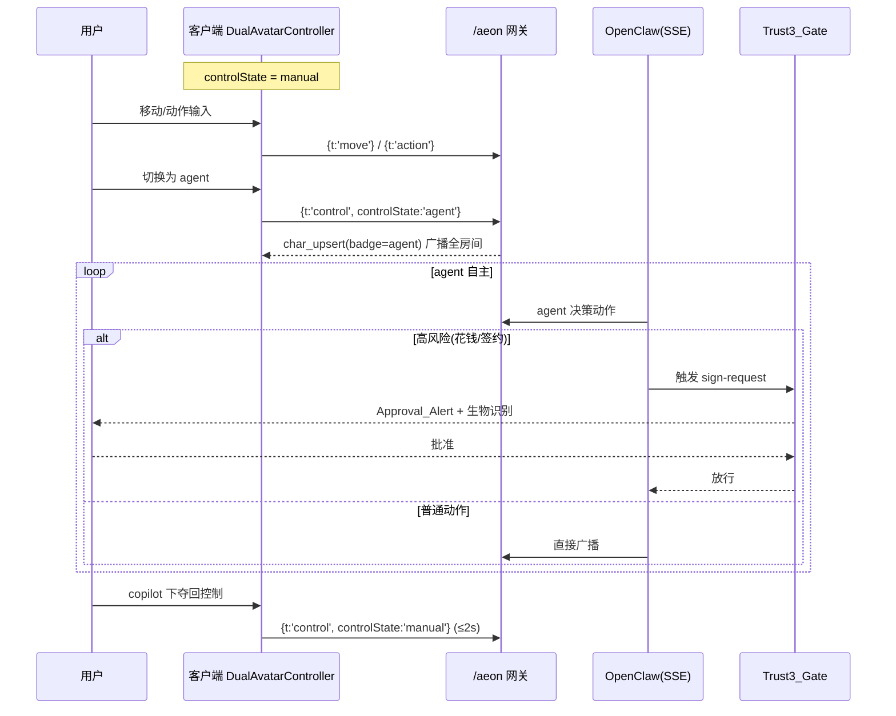

# Design Document — Aeon(永曜城)

## Overview

本设计文档为 `agentrix-world` 规格的技术设计,对应 `requirements.md` 中 23 条需求。目标是把当前"功能宫格、代入感差"的静态 World tab 重构为 **Aeon(永曜城)**——一个真实价值驱动、人机共建的实时多人平行世界。

**设计的最高约束(来自需求最高优先级):** 体验好、能彻底落地 > 机制炫酷。因此本设计**显式分阶段**,并把最高风险项(实时多人同步)放在**第 0 阶段技术验证(spike)**,spike 不通过则触发异步兜底,绝不盲目铺开。

**设计的核心复用原则:** Aeon 不重造已有能力。经调研(见 §现有底座复用表),平台已具备:Socket.IO 网关基础设施(6 个网关)、AXP 经济、支付通道(x402/Transak/agent-payment/escrow)、版税拆分、Trust3 签名、审批中心、agent 信誉、OpenClaw agent 执行(SSE)、world-sim 离线 tick/NPC/事件流、能力飞轮、workspace 套餐限额、Assistant Bridge intents。Aeon 在这些之上**新增**:实时同步层、房间/地块/组织/建造实体、虚拟公司、地球地图层。

> 术语沿用 requirements.md 的 Glossary(Aeon / Realtime_Sync_Layer / Room_Engine / Dual_Avatar_Controller / Control_State / Plot / Org_System / Virtual_Company / Task_Plaza / Bounty_Center / AXP_Economy / Trust3_Gate / Compliance_Gate / Agent_Fill_System / Epoch_Manager / World_Marketplace 等),本文不重复定义。

## 现有底座复用表(设计的事实基础)

> 来源:对 backend/src 与 src/services 的代码调研。"复用"=直接用;"扩展"=在其上加能力;"新建"=Aeon 全新。

| 能力域 | 现状 | 结论 | 关键路径 |
|---|---|---|---|
| WebSocket 传输 | Socket.IO 6 网关(`/ws` `/presence` `/world-engine/jobs` `/voice` `/remote-control` `/relay`),JWT 握手鉴权,per-user 房间 | **扩展**(新增 `/aeon` 房间位置同步网关) | `modules/websocket/websocket.gateway.ts`、`modules/agent-presence/handoff/presence.gateway.ts` |
| 多实例扩展(Redis adapter) | **不存在**(`ioredis` 被注释,跨进程靠 in-process EventEmitter 总线) | **新建**(spike 必须评估,见 R1) | `modules/cache/cache.service.ts` |
| 聊天流 | SSE over HTTP POST(`/openclaw/proxy/:id/stream`),**非 WS** | 复用(agent 执行)| `modules/openclaw-proxy/openclaw-proxy.service.ts` |
| AXP 经济 | `getBalance/earn/spend` + 账本 | **复用**(Aeon 结算单位) | `modules/axp/axp.service.ts`、`v1/axp/*` |
| 数字货币支付 | x402 / Transak on-ramp / withdrawal / escrow / agent-payment / crypto-payment | **复用**(R11/R12 数字货币结算) | `modules/payment/*` |
| 钱包余额 | `getWalletBalance` 是 **mock 桩** | **扩展**(接真实链上余额) | `modules/wallet/wallet.service.ts` |
| 版税拆分 | `splitRoyalty` + 多代创作者链 | **复用**(R11.7/R23.6) | `modules/marketplace-pet/royalty-splitter.ts`、`pet-skin.service.ts previewRoyaltySplit` |
| Trust3 签名 | `sign_requests` 实体 + 创建/完成/取消 + presence 事件 + 生物识别 | **复用**(R11.3/R11.4 闸门) | `modules/sign-request/*`、`v1/wallet/sign-request` |
| 审批中心 | Approval_Alert / ApprovalCenter | **复用** | `modules/approval/*` |
| OpenClaw agent | 实例实体 + SSE 执行 + DelegationLevel | **复用**(agent 控制态执行) | `entities/openclaw-instance.entity.ts`、`modules/openclaw-proxy/*` |
| agent 信誉 | `agent_reputations`(specializations) | **复用**(R8.4/R9.2 候选信誉) | `entities/agent-reputation.entity.ts` |
| 套餐限额 | FREE=3/PRO=10/BUSINESS=50/ENT=200 agents | **复用**(公司 agent 员工上限) | `modules/workspace/workspace.service.ts` |
| world-sim tick | 离线回合制 + 确定性 seed + 事件流 + 4 NPC | **复用 + 扩展**(异步层 R13;实时是新层 R1) | `modules/world-engine/services/world-sim.service.ts` |
| world-asset / 能力飞轮 | `world_assets` + `abilitySnapshot` + `worldState` jsonb | **复用** | `modules/world-engine/entities/world-asset.entity.ts` |
| 世界资产市场 | `v1/marketplace/world-assets`(listing/browse/purchase 两阶段提交) | **复用**(R23) | `modules/world-engine/controllers/marketplace.controller.ts` |
| Assistant Bridge | 15 个 intents + 跨厂商分发 | **复用**(R20 游戏→现实) | `src/services/intents/intentBridge.ts` |
| 地图/地理 | 后端**无 lat/lng**;移动端有 `expo-location`,**无 MapLibre** | **新建**(地球地图层 R4) | `src/services/deviceBridging.service.ts` |
| 组织/公司 | **无 Org-with-ledger 实体**;仅 workspace/pet-team/agent-team 接近 | **新建**(R6 虚拟公司) | `modules/workspace/*`(参考) |
| 房间/地块/建造 | **不存在** | **新建**(R4/R5/R10) | — |

## Goals / Non-Goals

**Goals(MVP / 地球纪元):**
- 用一套"房间引擎 + 实时同步层"做穿共同在场,先验证可行性(spike),再支撑虚拟公司/任务/市场场景。
- 双控位(manual/agent/copilot)三态 + 人机可视区分(铁律)。
- 地球地图选址圈地(用法 a)→ 进入 2.5D 等距地块场景 + 共建 L2 建造。
- 一条端到端价值闭环跑通:圈地 → 开公司 → 发任务 → agent 接单 → 验收 → 发 AXP。
- 最大化复用现有经济/支付/签名/agent/市场底座。

**Non-Goals(见 requirements §22 / Out of Scope):** 舞台原语、活动系统、火星/银河纪元、L3 治理、GPS 围栏、全球数字孪生、现实物资交易、室内 3D、端上实时多人 3D。架构需"预留不阻断",但 MVP 不构建。

## 实施阶段总览(Phasing — 设计的骨架)

> 每个阶段都有明确的"通过判据";前一阶段不达标不进入下一阶段。这是"能彻底落地"的执行保证。

- **Phase 0 — 实时同步 Spike(R1,先行,门禁)**:独立验证 Socket.IO 房间位置/状态同步 + Redis adapter 多实例扩展的延迟/带宽/成本。产出 go/no-go 报告。**不通过 → 触发异步兜底,Room 降级为非实时共同在场。**
- **Phase 1 — 世界骨架(R4/R5/R17/R19)**:Epoch + 地球地图层 + 地块 + 房间引擎(消费 Phase 0 同步层)+ 持久化。
- **Phase 2 — 双控位与身份(R2/R3/R21)**:三态控制器 + 人机标识 + agent 自主社交边界。
- **Phase 3 — 价值闭环(R6/R7/R8/R9/R11/R12/R23)**:虚拟公司 + 任务广场 + 招聘发薪 + 悬赏 + 经济/合规闸门 + 世界市场。
- **Phase 4 — 留存与共建(R10/R13/R14/R20)**:建造系统 + agent 填场/异步 + 复用底座接入 + 现实闭环。
- **Phase 5 — 体验打磨(R15/R16/R18)**:美术概念图落地 + 新手引导 + 性能/跨端达标。

---

<!-- 后续章节(架构图 / 数据模型 / 各组件设计 / 错误处理 / 测试策略 / 安全 / 需求覆盖矩阵)将以 append/edit 方式补充 -->
## Architecture

### 系统分层总览



### 实时 vs 异步双轨(本设计的关键架构决策)

Aeon 同时存在两套时间模型,**有意共存**:

1. **实时轨(Realtime,Phase 0 验证)**:房间内"同框"——位置、控制态、就近聊天、动作事件。走新的 `/aeon` Socket.IO 网关。这是"高光时刻"。
2. **异步轨(Async-first,复用 world-sim)**:任务结算、打工产出、离线事件、agent 填场行为、发薪。走现有 `world-sim` tick + `world_events` + 新的 `Async_Inbox`。这是"日常留存",不要求双方同时在线。

> 决策依据(R13.6 + 落地纪律 §10.2):核心价值闭环(发任务→agent 接单→验收→发 AXP)**必须能纯异步完成**。实时只是叠加在异步之上的体验增强。即使 Phase 0 spike 判定 no-go,异步轨仍独立可用,产品不死。

### 实时同步层设计(Realtime_Sync_Layer,Phase 0 重点)

**传输选型决策:**
- **首选 Socket.IO**(复用现有 6 网关的鉴权/房间/重连模式,团队已熟),新增 `namespace: '/aeon'` 网关。WebRTC(P2P/SFU)作为 spike 对照项评估,但 MVP 不引入(运维复杂、移动端不稳)。
- **权威模型**:服务器权威(server-authoritative)轻量版——客户端发送"意图"(目标位置/动作),服务器校验后广播。位置这类高频低风险数据可用**客户端预测 + 服务器广播**降低体感延迟。
- **房间 = Socket.IO room**(`aeon:room:<roomId>`),与现有 `user:<id>` 房间模式一致。
- **多实例 fan-out**:必须引入 **Socket.IO Redis adapter**(当前不存在,见复用表)。这是 spike 的核心评估项之一——没有它,多后端实例下同一房间的用户收不到彼此消息。

**同步消息契约(写入 `shared/types/`,满足 R1.7 / R3.5 / R18.3 跨端一致):**

```typescript
// shared/types/aeon-sync.ts (NEW)
export type AeonControlState = 'manual' | 'agent' | 'copilot';

export interface AeonCharacterSnapshot {
  charId: string;            // 角色实例 id(= world_asset id 或主宠 id)
  ownerUserId: string;
  controlState: AeonControlState;
  isAgentDriven: boolean;    // 铁律:渲染 ✋/🤖 的权威字段
  clan: 'A'|'B'|'C'|'D'|'E'|'F';
  x: number; y: number;      // 等距网格坐标
  facing: 'left' | 'right';
  sprite: string;            // 当前精灵动作(idle/walk/...)
  badge: 'human' | 'agent' | 'copilot' | 'npc'; // 身份标识
  displayName: string;
}

export type AeonClientEvent =
  | { t: 'move'; x: number; y: number; facing: 'left'|'right' }
  | { t: 'action'; action: string; targetCharId?: string }
  | { t: 'control'; controlState: AeonControlState }   // 控制态切换
  | { t: 'chat'; text: string; scope: 'proximity'|'room' };

export type AeonServerEvent =
  | { t: 'room_state'; roomId: string; chars: AeonCharacterSnapshot[]; serverTs: number }
  | { t: 'char_upsert'; char: AeonCharacterSnapshot; serverTs: number }
  | { t: 'char_leave'; charId: string; serverTs: number }
  | { t: 'chat'; fromCharId: string; text: string; attribution?: string; serverTs: number }
  | { t: 'action'; fromCharId: string; action: string; serverTs: number };

export const AEON_SYNC = {
  NAMESPACE: '/aeon',
  ROOM_PREFIX: 'aeon:room:',
  MOVE_THROTTLE_MS: 100,     // 客户端位置上报节流(≤10Hz)
  P95_LATENCY_TARGET_MS: 300,
  ROOM_CAPACITY_MVP: 20,
  DISCONNECT_GRACE_MS: 10000,
  RECONCILE_WINDOW_MS: 5000,
} as const;
```

**延迟预算(满足 R1.2 p95 ≤ 300ms):** 客户端节流上报(100ms)→ 服务器校验/广播(目标 <50ms)→ Redis adapter fan-out(目标 <50ms)→ 下行到其它客户端。spike 实测确认。

**断线处理(R1.4 / R5.7):** 心跳超时(`DISCONNECT_GRACE_MS=10s`)→ 广播 `char_leave` → 重连后服务器下发 `room_state` 全量快照对账(`RECONCILE_WINDOW_MS=5s`)。in-progress 任务态由后端权威持久化,不随断线丢失。

### Phase 0 Spike 决策树


## Data Models

> 全部新实体遵循仓库硬规则:TypeORM 全局 `SnakeNamingStrategy`,`@Column()` 内**不写 `name:`**(列名自动 snake_case)。表名统一 `aeon_` 前缀,避免与现有 world-engine 表冲突。复用实体(world_assets / axp_ledger / sign_requests / openclaw_instances / agent_reputations)不改结构,仅引用。

### 实体关系图



### 实体设计要点与权衡

- **AeonPlot.grid_cell + epoch 唯一约束**(满足 R4.3 地块唯一性):`@Unique(['epoch', 'gridCell'])`。`gridCell` 由 (lat,lng) 量化到网格(粒度 design 阶段定,初定 MapLibre zoom 16 ≈ 街区级);`lat/lng` 保留真实坐标做地图标记(R4.5)。GPS **不**用于限制圈地(R4.7)——只用坐标做选址锚,设备 GPS 与圈地解耦。
- **AeonRoomPresence(瞬时态,可选落库)**:实时在场是高频写,**首选放内存 + Redis**(随房间生命周期),`aeon_room_presence` 表仅作为"断线对账/重启恢复"的低频快照,不做每帧写库。这样既满足 R19 权威性(关键态可恢复),又不让实时高频压垮 PostgreSQL。
- **AeonOrg 账本**:权威余额 = `aeon_ledger_entries` 按 org 求和(可重建,满足 R19.4 可审计);`axp_ledger_balance` 仅缓存。**禁止负余额**(R6.6/R11.5)在分录写入事务里校验。
- **AeonOrgMember.agent_instance_id** 复用 `openclaw_instances.id`——agent 员工就是用户已有的 OpenClaw 实例,不新建 agent 概念。雇佣别人 agent 时 `member_user_id` = 员工 owner,`org.owner_user_id` = 雇主。
- **AeonTaskContract 统一三种任务**(plaza/bounty/kpi):用 `kind` 区分,状态机共用(见下节),避免为任务广场/悬赏/公司 KPI 各写一套。
- **AeonBuildItem.links_to**:放置的功能建筑(公司楼/会场)通过 `links_to_id/kind` 链接到背后的 Org/Room,进入建筑即打开对应空间(R10.6)。

### 任务/契约统一状态机(R7/R9 共用)



- **悬赏(bounty)差异**:`open` 前先 escrow 托管全额(R9.1,复用 `payment/escrow.service`);支持 `milestones` 分期放款(R9.4);托管资金仅经验收/完成/取消/争议路径释放(R9.7 硬边界)。
- **任务广场(plaza)**:无需 escrow(R7),验收即从发起方钱包转给承接方(可选预留 reservation,R7.8 过期释放)。
- **KPI(公司内)**:发起方 = 公司,承接方 = agent 员工,验收通过触发发薪(R6.5)。
## Components and Interfaces

> 后端新增模块统一在 `backend/src/modules/aeon/`(与现有 `world-engine` 并列,复用其服务通过依赖注入)。移动端新增 `src/screens/aeon/` + `src/services/aeon/`。

### 后端模块划分(`backend/src/modules/aeon/`)

| 子模块 | 职责 | 复用依赖 | 对应需求 |
|---|---|---|---|
| `realtime/aeon-realtime.gateway.ts` | `/aeon` Socket.IO 网关:房间加入/离开、位置/动作/聊天广播、断线对账 | websocket.gateway 模式、JWT、(新)Redis adapter | R1, R5 |
| `realtime/room-presence.service.ts` | 房间在场态(内存+Redis),Agent_Fill 注入 | — | R5, R13 |
| `plot/plot.service.ts` + `plot.controller.ts` | 地块圈定/唯一性/休眠回收;`v1/aeon/plots` | — | R4 |
| `room/room.service.ts` + `room.controller.ts` | 房间 CRUD + 配置(原语组合);`v1/aeon/rooms` | — | R5 |
| `org/org.service.ts` + `org.controller.ts` | 组织/虚拟公司/成员/账本;`v1/aeon/orgs` | axp、openclaw、agent_reputations、workspace 限额 | R6, R8 |
| `org/clock-in.service.ts` | agent 员工打卡调度 + 产出计量 | openclaw-proxy(SSE 执行) | R6 |
| `task/task-contract.service.ts` + controller | 统一任务/悬赏状态机;`v1/aeon/tasks` | task_post/task_search、escrow、axp | R7, R9 |
| `build/build.service.ts` + controller | 地块布局放置/校验/持久化/权限;`v1/aeon/build` | world_assets(可放置物) | R10 |
| `economy/aeon-economy.service.ts` | Aeon 价值流转门面:统一 AXP/数字货币结算 + Trust3 闸门路由 | axp、payment(x402/Transak)、sign-request | R11, R12 |
| `marketplace/` | 世界市场聚合(转发现有市场)+ 市场街区 | world-asset/skin marketplace、royalty-splitter | R23 |
| `epoch/epoch.service.ts` | 纪元解锁/锁定/作用域 | — | R17 |
| `fill/agent-fill.service.ts` | agent 填场池 + 降频 + opt-out | world-sim NPC、openclaw | R13 |
| `inbox/async-inbox.service.ts` | 离线事件聚合 digest | world_events | R13, R20 |
| `news/world-news.service.ts` | 涌现事件流 → LLM 微剧情 + 排行榜 | world-sim 事件流、Bedrock | R14 |

### 双控位控制器(Dual_Avatar_Controller,R2)

**位置**:逻辑横跨客户端(输入路由)+ 后端(agent 执行编排)。



- **三态语义**(R2.1-2.5):`manual` 路由真人输入忽略 agent;`agent` 由绑定 OpenClaw 实例 SSE 驱动;`copilot` agent 朝用户设定目标执行、真人可随时夺回(≤2s)。
- **状态保持**(R2.6):切换不丢位置/库存/在途任务——这些是后端权威态,控制态切换只改"谁发指令"。
- **agent 不可用兜底**(R2.8):暂停自主、置 idle、Async_Inbox 通知 owner。
- **高风险闸门**(R2.7 → R11.3):agent/copilot 态下花钱/签约走 Trust3,复用 `sign-request` 全链路(创建→presence 事件→生物识别→complete)。

### 人机可视区分(Identity_Badge_System,R3 铁律)

- **权威字段**:`AeonCharacterSnapshot.isAgentDriven` + `badge`,由后端在每次控制态变更时随同步消息下发(R3.4 同一同步周期更新)。
- **渲染**:✋(manual)/ 🤖(agent)/ 🤖+✋(copilot)/ NPC 标记,所有渲染角色的视图都带(浮球、房间、详情、市场、任务卡)。
- **归因**(R3.3):agent 发消息/接任务/交易,产物标注"由 <owner> 的 agent 执行";`AeonServerEvent.chat.attribution` 字段承载。
- **硬边界**(R3.6):无任何关闭人机区分的配置项——代码层面不提供该开关。跨端用 `shared/types/aeon-sync.ts` 的 `badge` 字段统一(R3.5)。

### 地球地图层(Earth_Map_Layer,R4)

- **渲染**:移动端引入 **MapLibre GL(`@maplibre/maplibre-react-native`)** + OpenStreetMap 瓦片(免费可商用);桌面端 MapLibre GL JS。这是**新依赖**(operator 在 WSL 装,移动端需 EAS rebuild)。
- **选址圈地**:点地图可用点 → `POST v1/aeon/plots/claim {lat,lng}` → 后端量化到 `gridCell`、校验 `@Unique(epoch+gridCell)`、创建 Plot。
- **进入场景**(R4.4):点已拥有 Plot → 客户端切到该 Plot 的 2.5D 等距场景(≤5s),拉 `GET v1/aeon/rooms?plotId=` + 房间在场态。
- **他人地块可见**(R4.5):地图 marker 显示已圈地块 + owner,可导航拜访。
- **休眠回收**(R4.6):`last_activity_at` 超期 → 标记 dormant → owner 通知后格子可回收。
- **不依赖 GPS**(R4.7):圈地/进入与设备定位解耦;`expo-location` 仅在用户主动"定位到我附近"时可选用,不作准入限制。
- **降级**(R4.8):瓦片加载失败 → 缓存/简化底图 + 重试,不丢进行中的圈地。

### 房间引擎(Room_Engine,R5)

- **Room = 共同在场容器**,2.5D 等距渲染,容纳真人 + agent(R5.1)。
- **进入**:加入 `aeon:room:<roomId>` socket 房间 → 服务器下发 `room_state` 快照 + 广播 `char_upsert`(R5.2,延迟受 R1.2 约束)。
- **用途由原语组合配置**(R5.3):`AeonRoom.config` 声明该房间挂了哪些原语(任务台/工位/市场货架/舞台-future),引擎不写死场景。
- **容量**(R5.5):默认 20,超限拒绝/排队。
- **空房 → Agent_Fill**(R5.6 → R13):无真人时填场。
- **室内静态背景 + 站位**(R5.8 → R15.4):不做室内 3D。
### 虚拟公司 / OPC(Org_System,R6 首发样板)

- **创建公司**(R6.1):`POST v1/aeon/orgs` → 创建 `AeonOrg`(kind=company)+ 关联公司 `AeonRoom` + 初始化账本(分录表)+ 对外门面(招聘/接单页,即一个可访问的 Room 配置)。
- **工位 + KPI**(R6.2):`AeonOrgMember`(role=agent_employee)绑定到工位,KPI 以 `AeonTaskContract(kind=kpi)` 挂在工位上。
- **打卡执行**(R6.3,`clock-in.service`):排定时段内把 agent 员工置于公司房间 `agent` 控制态,通过 OpenClaw SSE 自主执行任务。
- **产出计量**(R6.4):记录尝试/完成/验收任务数,归属该 agent,用于发薪 + KPI。
- **发薪**(R6.5):工作周期结束 + 验收通过 → 从公司账本按 AXP 付给 agent owner(经 AXP_Economy)。
- **余额保护**(R6.6):账本不足停止增薪工作 + 通知,**禁止负余额**(分录事务校验)。
- **升级路径**(R6.7):OPC→小团队→企业 = 给现有 Org 加 `human_member`,不重建公司;agent 上限复用 workspace 套餐(FREE=3/PRO=10/...)。
- **雇佣记账**(R6.8 → R8):雇来的 agent 在账本记 雇主=payer / agent owner=payee。

### 任务广场 + 招聘 + 悬赏(Task_Plaza / Hiring / Bounty,R7/R8/R9)

- **统一状态机**(见数据模型),三 `kind` 共用。复用现有 `task_post`/`task_search` 平台工具做发布/检索(R7.1/7.2)。
- **任务广场**(R7):发布→接单(独占,R7.3)→提交→验收放款(R7.5)/驳回(R7.6)/过期释放(R7.8);agent 承接标注归因(R7.7)。
- **招聘发薪**(R8):发 offer→对方 agent 接→绑为 agent_employee→验收周期→发 AXP 工资;候选展示 `agent_reputations` 信誉(R8.4);提前撤回结算已完成部分(R8.6)。
- **悬赏**(R9):创建即 escrow 托管全额(复用 `payment/escrow.service`)→竞标(展示信誉)→授标→里程碑分期放款(R9.4)→争议托管不放(R9.6)→托管完整性硬边界(R9.7)。

### 经济与合规(AXP_Economy + Compliance_Gate,R11/R12)

```mermaid
graph LR
  Action["世界内价值动作<br/>(发薪/任务/悬赏/市场/门票)"] --> Econ["AeonEconomyService"]
  Econ --> Currency{"币种?"}
  Currency -->|AXP| AXPSvc["axp.service<br/>earn/spend + 账本"]
  Currency -->|数字货币| Comp["Compliance_Gate<br/>KYC/AML/未成年/地区开关"]
  Comp -->|通过| Pay["payment<br/>x402/Transak/crypto"]
  Comp -->|不可用/未过| Fallback["回退 AXP-only<br/>(R12.7)"]
  Econ --> Risk{"agent 高风险?"}
  Risk -->|是| T3["Trust3_Gate<br/>sign-request + Approval"]
  Risk -->|否(普通赚取)| Direct["直接入账(R11.6)"]
  T3 -->|批准| Pay
  T3 -->|超时/拒| Block["阻断, 状态不变(R11.4)"]
```

- **统一结算门面**(R11.1):`AeonEconomyService` 是世界内一切价值流转的唯一入口,支持 AXP 或数字货币(经 Compliance_Gate),复用现有钱包/支付/版税。
- **可审计账本**(R11.2/R19.4):每笔 AXP 流转记 payer/payee/amount/reason/ts,可重建。
- **高风险闸门**(R11.3/11.4):agent/copilot 花钱/签约走 Trust3,超时/拒绝则阻断且状态不变。
- **禁负余额**(R11.5)、**普通赚取免审批**(R11.6)、**版税拆分**(R11.7)。
- **合规**(R12):AXP + 数字货币 MVP 均支持(复用现有 x402/Transak),按地区/能力开关;数字货币兑换/提现前 KYC;AML 命中冻结审查;未成年限制真钱能力;无 KYC/AML 不得提现(硬边界);某地区不支持数字货币则回退 AXP-only(R12.7)。

### 世界市场(World_Marketplace,R23)

- **复用,不另造**(R23.1):聚合现有世界资产市场(`v1/marketplace/world-assets`)+ 皮肤市场(`pet-skin` + `royalty-splitter`)+ Skill 市场。Aeon 侧只做**聚合门面 + 市场街区房间**。
- **市场街区**(R23.2):一个 `AeonRoom(kind=market)`,可走进去浏览货架(房间内 BuildItem 链接到 listing)。
- **买卖**(R23.3-5):浏览/上架/购买经 `AeonEconomyService` 用 AXP 或数字货币结算(经 Compliance_Gate);版税拆分复用(R23.6)。
- **agent 买卖**(R23.7):走 Trust3 + 归因。
- **结算失败不转移所有权**(R23.8):两阶段提交(现有 marketplace 已有 two-phase commit 协议)。

### Agent 填场与异步(Agent_Fill / Async_Inbox,R13)

- **填场**(R13.1):房间真人 < 活跃阈值时,注入 owner 的 agent + 他人 opt-in 的 agent + world-sim NPC。
- **身份标记**(R13.2):填场参与者一律带 agent/NPC 标识,绝不冒充真人(R3 铁律)。
- **降频**(R13.3):填场 agent 空闲 ≥5 分钟降低自主动作频率(复用现有 idle 语义),控成本。
- **异步收件箱**(R13.4/13.5):聚合离线期间任务/消息/工资/事件成 digest;针对离线用户的动作入队异步处理。
- **纯异步闭环**(R13.6):发任务→agent 接→验收→发 AXP 全程不需双方同时在线(复用 world-sim tick 推进)。
- **opt-out**(R13.7):用户可让自己 agent 不进他人填场池。

### 复用底座接入 + 现实闭环(R14 / R20)

- **复用**(R14):chibi 精灵贴等距图(R14.1)、扫描资产 2D 可用(R14.2)、能力飞轮 buff(R14.3)、world-sim 事件流升级为 LLM 微剧情入 World_News(R14.4/14.5)、Assistant Bridge intents 游戏→现实(R14.6)、WorldGameRuleSet UGC(R14.7)、cartoon style transfer 统一画风(R14.8)。
- **现实双向闭环**(R20):真实 agent 任务/Computer Use 完成 → 世界奖励(AXP/buff,R20.1);扫描物体入世界(R20.2);世界事件触发 Assistant Bridge intent(R20.3);世界 AXP 入现有钱包跨 Agentrix 可用(R20.4)。

### 纪元(Epoch_Manager,R17)

- 有序纪元 `earth|mars|galaxy`,MVP 仅 `earth` 激活(R17.1)。
- Plot/Org/Room 作用域到 epoch(R17.2),未来纪元可加而不废 earth 数据。
- 未发布纪元锁定+预览,不可圈地/进入(R17.3);解锁机制本身 out of MVP(R17.4)。
### 美术 / 新手引导 / 性能(R15/R16/R18)

- **美术概念图验证**(R15):大规模生产前先出"科技未来城"概念图(等距地块 + 模块化建筑外观 + 1 张室内氛围背景),确认现有 chibi 精灵贴在等距背景上读得清(R15.2);不通过则记录备选方向(如治愈风)并阻断量产(R15.3)。延续现有"AI 出量 + 人工把关 + cartoon style transfer"路子。室内静态背景(R15.4)、全局昼夜/天气滤镜单层叠加(R15.5)。
- **新手引导**(R16):任意房间首次进入 60 秒内引导完成一个有意义动作(移动/切控制态/交互);单一教程框架复用到所有场景(公司/广场/市场);完成不强制重复但可随时再看;卡住给上下文提示。复用现有"怎么玩"教程模式(对战屏已落地)。
- **性能/跨端**(R18):2.5D 场景移动端(≥4GB)稳定 ≥30 FPS(p95);房间 20 人内同步守 R1.2;移动(RN+Expo)/桌面(Tauri)功能对等,消费 `shared/types` 同一契约;两条 chat 路径(`/openclaw/proxy/:id/stream` 与 `/claude/chat`)保持同步;依赖不可用时优雅降级到异步/只读不崩;默认中文;**先跑通一条端到端闭环再扩**(R18.7)。

## Correctness Properties

> 这些是无论实现如何都必须始终成立的不变式,作为属性测试/审计的依据。

### Property 1: 账本守恒
任一 `AeonOrg` 的权威余额恒等于其 `aeon_ledger_entries` 分录代数和;任何转账都是等额 payer 减 / payee 加,系统总 AXP 不因转账增减。
**Validates: Requirements 11.2, 19.4**

### Property 2: 非负余额
任何钱包/账本操作完成后余额 ≥ 0;会导致负余额的操作必须被拒绝。
**Validates: Requirements 6.6, 11.5**

### Property 3: 托管完整性
悬赏 escrow 资金只能经"里程碑验收 / 完成 / 取消 / 争议裁定"四条路径释放,任何其它路径不得动用托管金。
**Validates: Requirements 9.7**

### Property 4: 人机不可混淆
任一被渲染的角色在任一时刻有且仅有一个明确身份标识(human/agent/copilot/npc),且不存在任何配置可将其隐藏。
**Validates: Requirements 3.1, 3.6**

### Property 5: 控制态单一
任一角色在任一时刻 `controlState` ∈ {manual,agent,copilot} 恰一个。
**Validates: Requirements 2.1**

### Property 6: 高风险必经闸门
agent/copilot 态下的花钱/签约/高风险动作,未经 Trust3 批准不得改变任何余额或合约状态。
**Validates: Requirements 11.3, 11.4**

### Property 7: 地块唯一
同一 `(epoch, grid_cell)` 至多一个 active Plot。
**Validates: Requirements 4.3**

### Property 8: 状态机合法性
`AeonTaskContract.state` 只能按状态机允许的边迁移,非法迁移被拒绝。
**Validates: Requirements 7.3, 9.3**

### Property 9: 权威一致
客户端与后端冲突时以后端为准;写权威态失败时绝不向用户报成功。
**Validates: Requirements 19.3, 19.5**

### Property 10: 纪元作用域
Plot/Org/Room 恒属于某个 epoch;未发布 epoch 不可被圈地/进入。
**Validates: Requirements 17.2, 17.3**

### Property 11: 结算原子性
市场/任务结算要么完整完成(转账+所有权转移),要么完全回滚,不存在"扣款未转移"或"转移未扣款"的中间态。
**Validates: Requirements 23.8**

## Error Handling

| 场景 | 策略 | 需求 |
|---|---|---|
| 实时 spike 判定 no-go | Room 降级为异步共同在场(事件流快照/轮询),核心闭环不受影响 | R1.6 |
| 客户端断线 | 10s 宽限 → `char_leave` 广播 → 重连下发全量 `room_state` 对账,在途任务后端权威保留 | R1.4, R5.7 |
| agent(OpenClaw)不可用 | 暂停自主、置 idle、Async_Inbox 通知 owner | R2.8 |
| 地图瓦片加载失败 | 缓存/简化底图 + 重试,不丢进行中圈地 | R4.8 |
| 公司账本不足发薪 | 停止增薪工作 + 通知,禁止负余额 | R6.6 |
| 任务验收驳回 | 回 in_progress 附原因或走争议路径,不放款 | R7.6 |
| 悬赏争议 | 争议部分留托管,走仲裁路径,不释放 | R9.6 |
| 数字货币不可用(地区/未 KYC) | 回退 AXP-only,不阻断非真钱功能 | R12.7 |
| Trust3 超时/拒绝 | 阻断动作,余额与合约状态不变 | R11.4 |
| 结算失败 | 不转移所有权,余额不变,向用户暴露失败(两阶段提交) | R23.8, R19.5 |
| 并发建造冲突 | last-write-wins 或区域锁(design 定),保持布局内部一致 | R10.7 |
| 权威态写失败 | 向用户暴露失败,不报成功,保留旧态 | R19.5 |

## Testing Strategy

- **Phase 0 spike(R1)**:独立压测 20 并发的 p95 延迟/带宽/成本;断线重连对账;产出 go/no-go 报告(这是设计能否继续的门禁,优先于一切)。
- **单元测试**:任务/悬赏状态机迁移(含非法迁移拒绝)、账本不负、版税拆分、纪元作用域、地块唯一性、Compliance_Gate 各分支(AXP/数字货币/未 KYC/未成年/地区回退)。
- **集成测试(后端)**:端到端价值闭环(圈地→开公司→发任务→agent 接单→验收→发 AXP)纯异步走通;悬赏 escrow 释放路径全覆盖;Trust3 闸门拦截高风险。
- **跨端契约测试**:`shared/types/aeon-sync.ts` 在移动/桌面消费一致;人机标识字段渲染一致。
- **E2E(Maestro,移动)**:进地图→圈地→进房间→切控制态(看徽章变化)→开公司→发任务→市场购买。沿用现有 `.maestro/` 体系。
- **性能**:2.5D 场景 30 FPS;房间 20 人同步延迟。
- **环境约束**:当前 Windows 检出 node_modules 为桩,本地只能 `getDiagnostics`;tsc/jest/构建需 WSL 或 CI。

## 安全与合规(Security)

- **网络暴露**:`/aeon` 网关 JWT 握手鉴权(复用现有网关模式),房间级权限校验(谁能进哪个房间/改哪块地)。
- **人机区分铁律**(R3):合规底线,无关闭开关;agent 行为全程归因。
- **真钱合规**(R12):KYC/AML/未成年保护 + 分地区分能力开关;escrow 完整性;无 KYC/AML 不提现。
- **agent 自主边界**(R21):agent 可主动社交,但花钱/签约/高风险走 Trust3;agent-to-agent 交互留日志可审计;被举报走审核路径。
- **防滥用**:信誉系统(agent_reputations)前置;填场 agent 降频防成本爆炸;两阶段提交防资产/资金不一致。
- **密钥/PII**:不在世界数据里存敏感凭证;地块坐标是用户主动选址的公开信息(非设备实时 GPS 追踪)。

## 需求覆盖矩阵(Requirements Traceability)

| 需求 | 设计落点 |
|---|---|
| R1 实时同步 spike | Architecture §实时同步层 + Phase 0 决策树;`/aeon` 网关 + Redis adapter + `aeon-sync.ts` 契约 |
| R2 双控位 | Dual_Avatar_Controller 时序图;客户端输入路由 + OpenClaw SSE + 状态保持 |
| R3 人机区分铁律 | Identity_Badge_System;`isAgentDriven/badge` 权威字段;无关闭开关 |
| R4 地球地图圈地 | Earth_Map_Layer(MapLibre+OSM);Plot grid_cell 唯一;不依赖 GPS |
| R5 房间原语 | Room_Engine;原语组合配置;容量 20;空房填场 |
| R6 虚拟公司 | Org_System + clock-in.service;账本;套餐 agent 上限 |
| R7 任务广场 | 统一任务状态机(plaza);复用 task_post/task_search |
| R8 招聘发薪 | Hiring(org member)+ agent_reputations |
| R9 悬赏 | bounty 状态机 + payment/escrow + 里程碑 |
| R10 共建建造 | Build_System;BuildItem 放置/权限/链接;并发冲突规则 |
| R11 经济+Trust3 | AeonEconomyService 门面 + Trust3_Gate;可审计账本;禁负余额 |
| R12 合规闸门 | Compliance_Gate;AXP+数字货币;KYC/AML/未成年/地区开关 |
| R13 填场+异步 | Agent_Fill + Async_Inbox;降频;纯异步闭环 |
| R14 复用底座 | 复用接入清单;world-sim→World_News(LLM) |
| R15 美术验证 | Concept_Art_Review;室内静态背景;昼夜滤镜 |
| R16 新手引导 | 单一教程框架;60s 首动作 |
| R17 纪元 | Epoch_Manager;earth-only;作用域 |
| R18 性能/跨端 | 30FPS;shared/types;双 chat 路径;降级;闭环优先 |
| R19 持久化 | PostgreSQL 权威;SnakeNaming;可审计账本;写失败处理 |
| R20 现实闭环 | 现实→游戏奖励/扫描入世;游戏→现实 Assistant Bridge |
| R21 agent 社交边界 | agent 主动社交但高风险走 Trust3;交互日志;举报 |
| R23 世界市场 | World_Marketplace 聚合现有市场 + 市场街区房间;两阶段提交 |

> 说明:R22(明确的未来/非 MVP 范围)为范围声明,设计上以"预留不阻断"体现——Room_Engine 可扩展 Stage 变体、Org_System 支持临时组织(活动)、Epoch 可加 mars/galaxy、地图层不焊死"虚拟坐标 vs 现实锚点",均在上文相应处预留接口而不构建。

## Open Design Questions(进入任务前可继续细化,不阻塞)

1. **地块网格粒度**:MapLibre zoom 层级 ↔ 真实地理范围的映射(初定街区级 zoom 16)。
2. **Redis adapter 选型**:`@socket.io/redis-adapter` + 自建 Redis vs 托管;成本以 spike 实测为准。
3. **争议仲裁流程**:人工/社区/自动的具体路径(R7.6/R9.6)。
4. **实时在场态存储**:内存+Redis 的具体 TTL 与重启恢复策略。
5. **MapLibre 移动端集成**:`@maplibre/maplibre-react-native` 需 EAS rebuild,排期与 expo-sensors 等原生依赖一起做。
