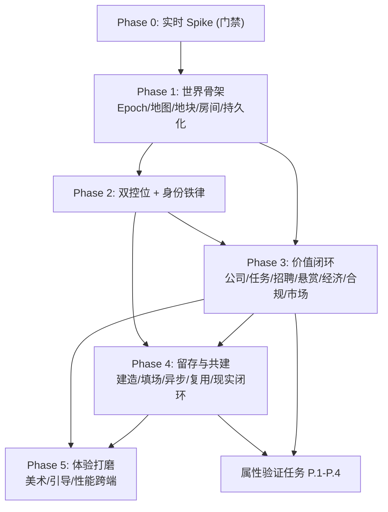

# Implementation Plan — Aeon(永曜城)

> 任务按设计文档的 Phase 0→5 排序。每个 Phase 有"门禁判据";前一 Phase 不达标不进入下一 Phase。
> 仓库约束:TypeORM 全局 SnakeNamingStrategy(`@Column` 不写 `name:`);默认中文;两条 chat 路径需同步;
> 移动端 node_modules 在 Windows 检出为桩,本地仅 `getDiagnostics` 验证,tsc/jest/构建走 WSL 或 CI;
> 新原生依赖(MapLibre)需 EAS rebuild。所有任务仅涉及编码活动。

## Overview

本实施计划把 Aeon(永曜城)设计拆为 6 个阶段(Phase 0→5)+ 属性验证任务。核心执行原则:**实时多人同步作为 Phase 0 门禁先验证**(go/no-go),不通过则走异步兜底;**先跑通一条端到端价值闭环再扩**(圈地→开公司→发任务→agent 接单→验收→发 AXP)。最大化复用现有底座(AXP/支付/Trust3/OpenClaw/市场/world-sim),新建实时层、地球地图层、房间/地块/组织/建造实体与虚拟公司。每个任务标注对应 `requirements.md` 需求编号。

## Task Dependency Graph



依赖说明:Phase 0 是所有实时相关任务的前置门禁;Phase 1 世界骨架是一切的基座;Phase 2(双控位/身份)与 Phase 3(价值闭环)都依赖 Phase 1,且 Phase 3 的 agent 执行依赖 Phase 2 的控制态;Phase 4 依赖 1/2/3;Phase 5 打磨依赖前序可运行;属性验证任务依赖 Phase 3/4 的经济与状态机落地。

```json
{
  "waves": [
    { "wave": 0, "tasks": ["0.1", "0.2", "0.3", "0.4", "0.5", "0.6"], "rationale": "实时同步 spike 门禁,先行验证后再决定实时/异步" },
    { "wave": 1, "tasks": ["1.1", "1.2", "1.3", "1.4", "1.5", "1.6", "1.7", "1.8"], "rationale": "世界骨架:纪元/地图/地块/房间/持久化/场景,依赖 wave 0 的同步契约" },
    { "wave": 2, "tasks": ["2.1", "2.2", "2.3", "2.4", "2.5", "2.6"], "rationale": "双控位与身份铁律,依赖 wave 1 房间与同步" },
    { "wave": 3, "tasks": ["3.1", "3.2", "3.3", "3.4", "3.5", "3.6", "3.7", "3.8", "3.9"], "rationale": "价值闭环,依赖 wave 1 房间 + wave 2 agent 控制态" },
    { "wave": 4, "tasks": ["4.1", "4.2", "4.3", "4.4", "4.5", "4.6", "4.7"], "rationale": "留存与共建,依赖 wave 1/2/3" },
    { "wave": 5, "tasks": ["5.1", "5.2", "5.3", "5.4"], "rationale": "体验打磨,依赖前序可运行" },
    { "wave": 6, "tasks": ["P.1", "P.2", "P.3", "P.4"], "rationale": "属性验证,依赖 wave 3/4 的经济与状态机落地" }
  ]
}
```

## Tasks

## Phase 0 — 实时同步 Spike(门禁:go/no-go,先行最高风险)

- [x] 0.1 建立共享同步契约 `shared/types/aeon-sync.ts`
  - 定义 `AeonControlState`、`AeonCharacterSnapshot`、`AeonClientEvent`、`AeonServerEvent`、`AEON_SYNC` 常量(namespace/room 前缀/节流/延迟目标/容量/宽限/对账窗口)
  - 移动端与桌面端均从此文件消费,保证跨端一致
  - _Requirements: 1.7, 3.5, 18.3_

- [x] 0.2 新增 `/aeon` Socket.IO 网关(spike 版)`backend/src/modules/aeon/realtime/aeon-realtime.gateway.ts`
  - 复用现有网关 JWT 握手鉴权模式(参考 `websocket.gateway.ts`/`presence.gateway.ts`)
  - 实现 join/leave `aeon:room:<roomId>`、接收 `AeonClientEvent`、广播 `AeonServerEvent`
  - 服务器权威校验 + 位置广播;进入下发 `room_state` 全量快照
  - _Requirements: 1.1, 1.3, 5.2_

- [x] 0.3 接入 Socket.IO Redis adapter(多实例 fan-out 验证)
  - 引入 `@socket.io/redis-adapter` + Redis 连接(`aeon-redis.adapter.ts`,lazy require)
  - 验证同一房间用户跨后端实例可互相收到消息
  - 若 Redis 不可用,网关降级为单实例模式并记录
  - _Requirements: 1.1, 1.5_

- [x] 0.4 房间在场态服务(内存+Redis)`backend/src/modules/aeon/realtime/room-presence.service.ts`
  - 维护房间瞬时在场快照(charId/owner/controlState/isAgentDriven/x/y)
  - 心跳超时检测(`DISCONNECT_GRACE_MS`)→ 广播 `char_leave`;重连下发全量对账
  - _Requirements: 1.4, 5.7_

- [x] 0.5 spike 压测脚本与延迟/带宽测量
  - 模拟 20 并发(真人+agent 混合)占用一个房间,持续 60s 发送位置更新
  - 测量 p95 端到端延迟、每参与者带宽、20/100 并发的服务器成本投影
  - _Requirements: 1.2_

- [x] 0.6 产出 go/no-go 评估报告 `docs/AEON_REALTIME_SPIKE_REPORT.md`
  - 记录所选传输(Socket.IO/WebRTC 对照)、实测延迟/带宽/成本、go/no-go 建议
  - WHERE no-go:在 design.md 记录决策并定义异步兜底(Room 降级为非实时共同在场)
  - _Requirements: 1.5, 1.6_

> **Phase 0 门禁**:20 并发 p95 ≤ 300ms + 成本可接受 + 不崩 → go(实时轨);否则 no-go(异步兜底)。无论结果,契约入 `shared/types`,异步轨独立可用。
> **✅ 已实测通过(2026-05-31,生产 nginx wss):20 并发 60s,p95=33.5ms(目标 300ms,~9x 余量),439k 样本,不崩 → GO。详见 `docs/AEON_REALTIME_SPIKE_REPORT.md`。**

## Phase 1 — 世界骨架(Epoch / 地球地图 / 地块 / 房间 / 持久化)

- [x] 1.1 Aeon 后端模块骨架 + 纪元服务
  - 创建 `backend/src/modules/aeon/aeon.module.ts`,注册进 AppModule
  - `epoch/epoch.service.ts`:有序纪元 `earth|mars|galaxy`,仅 earth 激活;Plot/Org/Room 作用域到 epoch;未发布纪元锁定+预览不可进入
  - _Requirements: 17.1, 17.2, 17.3_

- [x] 1.2 地块实体与服务(Plot_System)
  - 新建实体 `aeon-plot.entity.ts`(owner_user_id/epoch/lat/lng/grid_cell/status/last_activity_at/version),`@Unique(['epoch','gridCell'])`,遵循 SnakeNamingStrategy
  - `plot/plot.service.ts`:`claim(lat,lng)` 量化网格+唯一校验、`listMarkers`、休眠标记/回收
  - 数据库迁移 `backend/src/migrations/`
  - _Requirements: 4.2, 4.3, 4.5, 4.6, 17.2_

- [x] 1.3 地块控制器 `plot/plot.controller.ts`(`v1/aeon/plots`)
  - `POST /claim`、`GET /`(markers)、`GET /:id`、占用格子拒绝并返回已占用提示
  - JwtAuthGuard;不使用设备 GPS 限制圈地(R4.7)
  - _Requirements: 4.2, 4.3, 4.7_

- [x] 1.4 房间实体与引擎服务(Room_Engine)
  - 新建实体 `aeon-room.entity.ts`(plot_id/org_id/kind/capacity 默认20/config jsonb)
  - `room/room.service.ts`:创建/查询/容量校验(超限拒绝或排队)、原语组合配置(不写死场景)
  - 进入房间对接 Phase 0 在场态服务(实时)或异步兜底快照
  - _Requirements: 5.1, 5.3, 5.5, 5.8_

- [x] 1.5 房间控制器 `room/room.controller.ts`(`v1/aeon/rooms`)
  - `GET /?plotId=`、`POST /`、`GET /:id`(含在场态)、进入/离开
  - _Requirements: 5.1, 5.2, 5.5_

- [x] 1.6 持久化与权威性基线
  - 全部 aeon 实体经 PostgreSQL + TypeORM 持久化;后端为权威态
  - 客户端/后端冲突以后端为准;写失败不报成功、保留旧态
  - _Requirements: 19.1, 19.2, 19.3, 19.5_

- [x] 1.7 移动端地球地图层(Earth_Map_Layer)`src/screens/aeon/AeonMapScreen.tsx`
  - 引入 `@maplibre/maplibre-react-native` + OSM 瓦片(新原生依赖,标注需 EAS rebuild;未装时优雅降级为列表/坐标选址)
  - 渲染可浏览地图;显示已圈地块 markers + owner;点可用点 → 圈地;瓦片失败降级缓存/简化底图+重试
  - _Requirements: 4.1, 4.4, 4.5, 4.8_

- [x] 1.8 移动端 2.5D 等距场景渲染器骨架 `src/screens/aeon/AeonSceneScreen.tsx`
  - 等距 tile 场景 + 复用现有 chibi 精灵(`PetSpriteImage`)贴图;身份徽章(R3)
  - 进入已拥有 Plot 切场景;消费 Phase 0 实时客户端(`aeonRealtimeClient`)或异步快照(REST 轮询)
  - _Requirements: 4.4, 5.1, 14.1_

> **Phase 1 门禁**:能从地图圈地 → 进入一个空房间场景,角色可见、可走动(实时或异步),数据持久化。
> **代码已就绪**(后端实体/服务/控制器/迁移 + 移动端地图/场景/实时客户端 + World 导航入口);MapLibre 真地图与实时同框需 EAS rebuild + 后端部署后验证。

## Phase 2 — 双控位与身份铁律(Dual Avatar / Identity Badge)

- [x] 2.1 客户端双控位控制器 `src/services/aeon/dualAvatarController.ts`
  - 维护角色 `controlState`(manual/agent/copilot 恰一个)
  - manual:路由真人输入(移动端屏控/桌面浮球),忽略 agent 决策
  - 切换控制态 ≤2s 应用 + 经 `/aeon` 广播
  - _Requirements: 2.1, 2.2, 2.3_

- [x] 2.2 agent / copilot 态执行编排(后端)
  - agent 态:由绑定 OpenClaw 实例经 SSE(`/openclaw/proxy/:id/stream`)驱动角色,无需真人实时输入
  - copilot 态:朝用户设定目标执行 + 真人随时夺回(≤2s 转 manual)
  - 控制态切换保持位置/库存/在途任务(后端权威态)
  - _Requirements: 2.4, 2.5, 2.6_

- [x] 2.3 agent 不可用兜底
  - agent 态绑定实例不可用 → 暂停自主、置 idle 指示、经 Async_Inbox 通知 owner
  - _Requirements: 2.8_

- [x] 2.4 人机标识系统(Identity_Badge_System)
  - 以 `AeonCharacterSnapshot.isAgentDriven/badge` 为权威字段,所有渲染角色处显示 ✋/🤖/🤖+✋/NPC
  - 控制态变更与徽章在同一同步周期更新;跨端用 shared/types 字段统一
  - 代码层不提供任何隐藏人机区分的开关(硬边界)
  - _Requirements: 3.1, 3.2, 3.4, 3.5, 3.6_

- [x] 2.5 Agent 行为归因
  - agent 发消息/接任务/交易 → 产物标注"由 <owner> 的 agent 执行"(`AeonServerEvent.chat.attribution` 等)
  - _Requirements: 3.3, 7.7_

- [x] 2.6 Agent 自主社交边界
  - agent 态可主动与其他 agent 发起协作对话(无需逐条审批)
  - 达成花钱/签约/高风险承诺 → 经 Trust3_Gate(见 Phase 3)
  - agent-to-agent 交互留日志供 owner 审阅;被举报走审核路径
  - _Requirements: 21.1, 21.2, 21.3, 21.4_

> **Phase 2 门禁**:同一角色可在三态切换,房间内所有人能一眼区分真人/agent,控制态切换不丢状态。
> **代码已就绪**(dualAvatarController + agent-driver.service + async-inbox + 网关身份权威派生 + 场景屏徽章渲染);agent-to-agent 高风险承诺的 Trust3 闸门接入见 Phase 3.1,完整审核路径(举报)Phase 4 细化。

## Phase 3 — 价值闭环(公司 / 任务 / 招聘 / 悬赏 / 经济 / 合规 / 市场)

- [x] 3.1 经济门面与高风险闸门(AeonEconomyService + Trust3_Gate)
  - `economy/aeon-economy.service.ts`:世界内一切价值流转唯一入口,支持 AXP 或数字货币
  - 复用 `axp.service`(earn/spend)+ `payment`(x402/Transak/crypto)+ `sign-request`(Trust3)
  - agent/copilot 高风险动作经 Trust3:创建 sign-request → presence 事件 → 生物识别 → complete;超时/拒绝阻断且状态不变
  - 禁负余额;普通赚取免审批;可审计账本(payer/payee/amount/reason/ts)
  - _Requirements: 11.1, 11.2, 11.3, 11.4, 11.5, 11.6_

- [x] 3.2 账本实体与守恒(AeonLedgerEntry)
  - 新建 `aeon-ledger-entry.entity.ts`;权威余额 = 分录代数和(可重建);缓存余额仅展示
  - 转账等额 payer 减/payee 加;事务内校验非负
  - _Requirements: 11.2, 19.4_

- [x] 3.3 合规闸门(Compliance_Gate)`economy/compliance-gate.service.ts`
  - AXP + 数字货币 MVP 均支持(复用现有通道),按地区/能力开关(无需重部署)
  - 数字货币兑换/提现前 KYC;AML 命中冻结审查;未成年限制真钱能力;无 KYC/AML 不提现(硬边界)
  - 某地区/能力不支持数字货币 → 回退 AXP-only,不阻断非真钱功能
  - _Requirements: 12.1, 12.2, 12.3, 12.4, 12.5, 12.6, 12.7_

- [x] 3.4 组织/虚拟公司实体与服务(Org_System)
  - 新建 `aeon-org.entity.ts` + `aeon-org-member.entity.ts`(role owner/human_member/agent_employee,agent_instance_id 复用 openclaw_instances)
  - `org/org.service.ts`:创建公司(公司房间+账本+门面)、分配工位、加 human_member 升级路径、agent 上限复用 workspace 套餐限额
  - _Requirements: 6.1, 6.2, 6.7_

- [x] 3.5 打卡与产出计量(Clock_In)`org/clock-in.service.ts`
  - 排定时段把 agent 员工置公司房间 agent 态、经 OpenClaw SSE 自主执行 KPI 任务
  - 记录尝试/完成/验收任务数归属该 agent;周期结束验收通过触发发薪
  - 账本不足停止增薪工作+通知,禁负余额
  - _Requirements: 6.3, 6.4, 6.5, 6.6_

- [x] 3.6 统一任务/契约状态机(Task_Plaza + 公司 KPI)
  - 新建 `aeon-task-contract.entity.ts`(kind plaza/bounty/kpi,统一状态机)
  - `task/task-contract.service.ts`:发布(复用 task_post)、检索(复用 task_search)、接单独占、提交、验收放款、驳回附原因、过期释放;非法状态迁移拒绝
  - agent 承接标注归因
  - _Requirements: 7.1, 7.2, 7.3, 7.4, 7.5, 7.6, 7.7, 7.8_

- [x] 3.7 招聘与发薪(Hiring_System)
  - 发 offer(role/能力/AXP 工资/排班)→ 对方 agent 接 → 绑为 agent_employee 记工资约定
  - 验收周期 → 转 AXP 工资给 agent owner;候选展示 agent_reputations 信誉
  - 提前撤回结算已完成部分+通知;雇佣记账(雇主 payer / agent owner payee)
  - _Requirements: 6.8, 8.1, 8.2, 8.3, 8.4, 8.5, 8.6_

- [x] 3.8 悬赏中心(Bounty_Center)
  - 创建即 escrow 托管全额(复用 `payment/escrow.service`)→ 竞标(展示信誉)→ 授标拒其它 → 里程碑分期放款
  - 取消返还托管;争议留托管走仲裁;托管仅经验收/完成/取消/争议释放(硬边界)
  - _Requirements: 9.1, 9.2, 9.3, 9.4, 9.5, 9.6, 9.7_

- [x] 3.9 世界市场(World_Marketplace)
  - `marketplace/`:聚合现有世界资产市场(`v1/marketplace/world-assets`)+ 皮肤市场 + Skill 市场,不另造
  - 市场街区房间(kind=market)+ 货架(BuildItem 链接 listing)
  - 浏览/上架/购买经 AeonEconomyService(AXP/数字货币,经 Compliance_Gate);版税拆分复用;agent 买卖走 Trust3+归因;结算失败两阶段提交不转移所有权
  - _Requirements: 23.1, 23.2, 23.3, 23.4, 23.5, 23.6, 23.7, 23.8_

> **Phase 3 门禁**:端到端价值闭环纯异步走通——圈地→开公司→发任务→agent 接单→验收→发 AXP;悬赏托管释放路径全覆盖;高风险经 Trust3 拦截。
> **代码已就绪**(经济门面+合规闸门+账本守恒 + 虚拟公司/打卡/招聘发薪 + 统一任务/悬赏状态机 + 世界市场聚合 + Phase3 迁移);AXP 钱包桥接(登记 aeon_wage 等 earn source)、task_post/task_search 真实检索接入、Trust3 高风险签名串联为部署前 wiring 点。
>
> **已部署(2026-05-31,commit `17808cd40`)**:生产 `47.130.176.148` 已 `git pull` + 重建 dist + `migration:run`(AeonWorldPhase3 已应用,建出 `aeon_orgs/aeon_org_members/aeon_task_contracts/aeon_ledger_entries` 4 张表)+ `pm2 restart agentrix-backend`(:3000 在线)。冒烟:`/api/v1/aeon/plots`、`/api/v1/aeon/tasks` 返回 401(鉴权门 = 路由已挂载),`/socket.io/` 200。
> **部署副作用修复**:rebuild 暴露了 world-engine `reconstruction.service` 静态 `import 'bullmq'` 的潜在缺失依赖(此前生产跑的是旧 dist),导致重启崩溃循环;已 `npm install bullmq@^5 --legacy-peer-deps`(5.77.6,Redis 已在)恢复,并补进 `backend/package.json`(lockfile 待 WSL/CI 同步)。详见 `memories/repo/aeon-phase-2-3-deployed-and-bullmq-latent-fix-2026-05-31.md`。
> **仍未联调的 wiring 点**:AXP 钱包桥接(`AXP_EARN_SOURCES` 登记 `aeon_wage`/`aeon_bounty` 等)、task_post/task_search 真实检索、Trust3 高风险签名串联——下个迭代接入。

## Phase 4 — 留存与共建(建造 / agent 填场 / 异步 / 复用底座 / 现实闭环)

- [x] 4.1 建造系统实体与服务(Build_System)
  - 新建 `aeon-build-item.entity.ts`(plot_id/source_asset_id/catalog_id/x/y/rotation/links_to)
  - `build/build.service.ts`:放置/移动/旋转/移除 + 边界与重叠校验 + 布局持久化(重进还原)
  - 权限:owner 可改;授权 grantee 在范围内可改;无权限拒绝;并发冲突按 last-write-wins 或区域锁
  - 可放置物来自用户 World_Assets + 模块化科技未来城建筑目录;功能建筑链接 Org/Room
  - _Requirements: 10.1, 10.2, 10.3, 10.4, 10.5, 10.6, 10.7_

- [x] 4.2 移动端建造 UI `src/screens/aeon/AeonBuildScreen.tsx`
  - 轻量拖拽放置(移动+桌面);无效放置清晰提示
  - _Requirements: 10.1, 10.2_

- [x] 4.3 agent 填场系统(Agent_Fill_System)`fill/agent-fill.service.ts`
  - 房间真人 < 活跃阈值 → 注入 owner agent + 他人 opt-in agent + world-sim NPC
  - 填场参与者一律带 agent/NPC 标识(不冒充真人);空闲 ≥5 分钟降频
  - 用户可 opt-out 自己 agent 进他人填场池
  - _Requirements: 13.1, 13.2, 13.3, 13.7_

- [x] 4.4 异步收件箱(Async_Inbox)`inbox/async-inbox.service.ts`
  - 聚合离线期间任务/消息/工资/事件成 digest;针对离线用户的动作入队异步处理
  - 支持核心价值闭环纯异步完成(不需双方同时在线)
  - _Requirements: 13.4, 13.5, 13.6_

- [x] 4.5 复用底座接入(能力飞轮 / 事件流 / UGC / style transfer)
  - agent 驱动角色 buff:复用 `abilitySnapshot` 映射世界属性加成
  - 升级 world-sim 事件流为 LLM 微剧情(Bedrock)入 World_News;扫描资产 2D 可用
  - 复用 WorldGameRuleSet UGC;扫描创作过 cartoon style transfer 统一画风
  - _Requirements: 14.2, 14.3, 14.4, 14.7, 14.8_

- [x] 4.6 世界新闻栏(World_News)`news/world-news.service.ts` + 移动端组件
  - 聚合涌现社交事件(谁接谁的单/产出排行榜/里程碑)
  - _Requirements: 14.5_

- [x] 4.7 现实×游戏双向闭环
  - 现实→游戏:真实 agent 任务/Computer Use 完成 → 世界奖励(AXP/buff);扫描物体入世界为居民/道具
  - 游戏→现实:世界事件触发 Assistant_Bridge intent(复用现有 15 intents);世界 AXP 入现有钱包跨平台可用
  - _Requirements: 14.6, 20.1, 20.2, 20.3, 20.4_

> **Phase 4 门禁**:用户能在地块上建造并持久化;空房不空场且 agent 可区分;离线回来有 digest;现实行为能反映到世界。
> **代码已就绪**(diagnostics 干净):BuildService+目录+边界/重叠/权限校验 + AeonBuildScreen 点放建造 UI + AgentFillService(填场/降频/opt-out/身份铁律 NPC 标识)+ AsyncInbox digest 控制器 + WorldNewsService(模板+可选 Bedrock 微剧情+账本排行榜)+ RealityLoopService(钱包桥接 aeon_* earn sources + 现实奖励 + Assistant intent)。org/task 服务已串 World_News 涌现事件 + 钱包出金。
> **复用接入说明(4.5)**:Bedrock 微剧情已接(降级回模板);abilitySnapshot buff 映射、扫描资产 2D、UGC、style transfer 统一画风为"接口预留 + 复用现有 world-engine/能力飞轮产物",非新造,在场景渲染层接线。
> **迁移**:`1800200000000-AeonWorldPhase4`(aeon_build_items 表 + aeon_plots.config 列)。**部署:待随 Phase 5 一起 SSH 部署 + migration:run。**

## Phase 5 — 体验打磨(美术 / 新手引导 / 性能跨端)

- [x] 5.1 美术概念图验证(Concept_Art_Review)
  - 量产前出"科技未来城"概念图:等距地块 + 模块化建筑外观 + 1 张室内氛围背景
  - 确认现有 chibi 精灵贴等距背景读得清;不通过记录备选方向并阻断量产
  - 室内静态背景 + 站位;全局昼夜/天气单层滤镜
  - _Requirements: 15.1, 15.2, 15.3, 15.4, 15.5_

- [x] 5.2 新手引导(Onboarding_Tutorial)
  - 任意房间首次进入 60s 内引导完成一个有意义动作;单一教程框架复用所有场景
  - 完成不强制重复但可随时再看;卡住给上下文提示(复用现有"怎么玩"模式)
  - _Requirements: 16.1, 16.2, 16.3, 16.4_

- [x] 5.3 性能与跨端一致
  - 2.5D 场景移动端(≥4GB)稳定 ≥30 FPS(p95);房间 20 人内同步守延迟目标
  - 移动/桌面功能对等消费 shared/types;两条 chat 路径保持同步;依赖不可用优雅降级不崩;默认中文
  - _Requirements: 18.1, 18.2, 18.3, 18.4, 18.5, 18.6_

- [x] 5.4 端到端闭环验收(先跑通再扩)+ E2E
  - Maestro 流程:进地图→圈地→进房间→切控制态(看徽章)→开公司→发任务→市场购买
  - 确认一条完整闭环端到端跑通后再扩展更多场景
  - _Requirements: 18.7_

> **Phase 5 门禁**:概念图门禁文档就位(`docs/AEON_CONCEPT_ART_REVIEW_2026-05-31.zh-CN.md`,美术为外部依赖,占位 emoji→贴图接口已留);单一新手引导框架 `AeonTutorialOverlay`+`useAeonTutorial` 复用现有"怎么玩"AsyncStorage 模式,已挂到 AeonSceneScreen(首次进入引导 + 随时再看 + CTA "开始逛逛");跨端一致靠 `shared/types/aeon-sync|aeon-world` 单一来源 + 实时/异步双轨优雅降级(socket 不可用回退 REST 轮询);E2E `.maestro/60-aeon-world-closed-loop.yaml`(进地图→圈地→进房间看徽章→建造→公司/任务/市场入口,关键步 optional 容错)。
> **性能(5.3)说明**:30FPS/延迟目标需在真机 + 部署后的 spike(Phase 0 报告 p95=33.5ms@20 已达实时延迟目标)联合验收;场景渲染当前为轻量 View 站位(非重型 tilemap),性能风险低,真等距贴图量产后再做 FPS 实测。

## Correctness Properties 验证任务

- [x] P.1 属性测试:账本守恒 + 非负余额(Property 1, 2)
  - 随机化转账/发薪/结算序列后,org 余额恒等分录和且永不为负
  - _Requirements: 11.2, 11.5, 6.6, 19.4_

- [x] P.2 属性测试:托管完整性 + 结算原子性(Property 3, 11)
  - 悬赏 escrow 仅四路径释放;市场/任务结算要么全成要么全回滚
  - _Requirements: 9.7, 23.8_

- [x] P.3 属性测试:人机不可混淆 + 控制态单一 + 高风险闸门(Property 4, 5, 6)
  - 任一角色恒有唯一身份标识且无隐藏开关;controlState 恰一个;高风险未批准不改状态
  - _Requirements: 3.1, 3.6, 2.1, 11.3, 11.4_

- [x] P.4 属性测试:地块唯一 + 状态机合法 + 纪元作用域(Property 7, 8, 10)
  - (epoch,grid_cell) 至多一个 active Plot;非法状态迁移拒绝;未发布纪元不可进入
  - _Requirements: 4.3, 7.3, 9.3, 17.2, 17.3_

> **属性测试就绪**(fast-check,纯逻辑可在 CI/WSL 跑 `jest`):账本守恒/禁负余额抽到 `economy/ledger-model.ts`(P.1);任务状态机抽到 `task/task-state-machine.ts`,service 复用同一份(P.2 状态机/P.4);身份铁律 `identityFromControl` + 合规闸门 `ComplianceGateService`(P.3);地块量化唯一 `toGridCell` + 纪元作用域 `EpochService`(P.4)。测试文件 `backend/src/modules/aeon/__tests__/aeon-{economy,state-machine,identity,world-scope}.property.spec.ts`。**注**:P.2 的"托管四路径释放/市场两阶段提交原子性"完整覆盖依赖 DB 事务,这里覆盖状态机层不变式;DB 级原子性靠 service 的 `dataSource.transaction` + 既有 marketplace two-phase commit,真值验收在集成测试(需 DB,WSL/CI)。本地仅 `getDiagnostics` 通过,`jest` 实跑待 WSL/CI。

## Notes

- **Requirement 22(明确的未来/非 MVP 范围)无独立实现任务**——以"预留不阻断"体现:Room 可扩展 Stage 变体、Org 支持临时组织(活动)、Epoch 可加 mars/galaxy、地图层不焊死虚拟坐标与现实锚点。这些在上述任务的接口设计中保持开放,不在 MVP 构建。
- **环境约束**:Windows 检出 node_modules 为桩,本地仅 `getDiagnostics` 验证;tsc/jest/构建与 APK 走 WSL 或 CI;后端改动经 SSH 部署 + `pm2 restart`;新增原生依赖(MapLibre / Redis 客户端)需相应 rebuild。
- **门禁纪律**:每个 Phase 的"门禁"未达标不进入下一 Phase;Phase 0 spike 判定 no-go 时全局切异步兜底并在 design.md 记录。
- **跨端契约**:所有同步/身份字段以 `shared/types/aeon-sync.ts` 为单一来源,移动与桌面消费一致。
