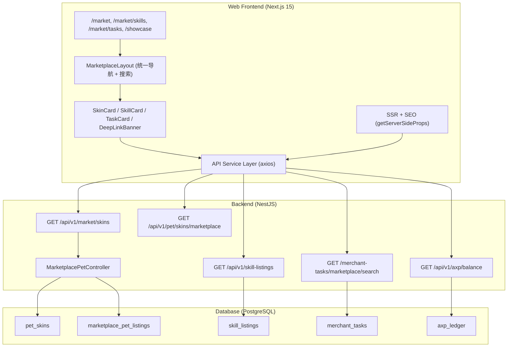
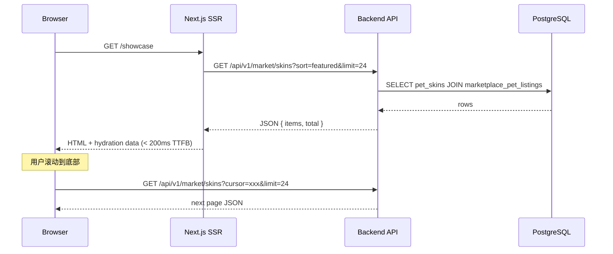

# Design Document: Marketplace Ecosystem

## Overview

Marketplace Ecosystem 是 Agentrix Web 端的核心展示与发现层，将当前使用渐变色占位块的 `/showcase` 页面升级为真实宠物资产展示，重新连接 `/skills` 页面与后端 `skill-listings` 模块，并构建皮肤交易发现、任务市场展示、跨平台导航三大板块。

**核心定位**：Web 端 = 展示 + 发现；移动端 = 交易闭环。

**技术栈**：
- 前端：Next.js 15 (Pages Router) + Tailwind (agentrix-ink 暗色主题) + Lucide Icons
- 后端：NestJS + TypeORM (SnakeNamingStrategy) + PostgreSQL
- 已有 API：`/api/v1/pet/skins/marketplace`、`/api/v1/skill-listings`、`/merchant-tasks/marketplace/search`、`/api/v1/axp/balance`
- 已有实体：`PetSkin`、`MarketplacePetListing`、`PetAuctionBid`

**设计目标**：
1. 用真实 API 数据替换所有 mock/gradient 占位
2. 统一 `/market` 路由下的导航结构（Skins / Skills / Tasks / Showcase）
3. 实现 SSR + SEO 优化（JSON-LD、Open Graph、< 200ms TTFB）
4. 提供清晰的 Web → Mobile 跨平台导航路径
5. 集成 AXP 积分展示

## Architecture



### 数据流架构



### 路由结构

| 路由 | 页面 | 数据源 |
|------|------|--------|
| `/showcase` | 每日精选画廊 | `GET /api/v1/market/skins?sort=featured` |
| `/market` | 皮肤交易发现 (Trending/New/Leaderboard) | `GET /api/v1/marketplace/pets` |
| `/market/skills` | 技能市场 | `GET /api/v1/skill-listings?status=approved` |
| `/market/tasks` | 任务市场 | `GET /merchant-tasks/marketplace/search` |
| `/market/skin/[id]` | 皮肤详情 | `GET /api/v1/marketplace/pets/:id` + `GET /api/v1/pet/skins/marketplace/:id` |

## Components and Interfaces

### 1. MarketplaceLayout 组件

统一导航壳，包裹所有 `/market/*` 和 `/showcase` 页面。

```typescript
interface MarketplaceLayoutProps {
  children: React.ReactNode;
  seo: MarketingSeo;
  activeSection: 'skins' | 'skills' | 'tasks' | 'showcase';
  showSearch?: boolean;
}
```

**职责**：
- 顶部导航栏：Skins / Skills / Tasks / Showcase 四个 tab
- 高亮当前活跃 section
- 全局搜索输入框（跨 skins/skills/tasks 搜索）
- 已登录用户显示 AXP 余额
- 底部 "Download App" 持久横幅

### 2. SkinCard 组件

```typescript
interface SkinCardProps {
  id: string;
  thumbnailUrl: string | null;
  displayName: string;
  clan: 'A' | 'B' | 'C' | 'D' | 'E' | 'F';
  creator: string;
  isOfficial: boolean;
  likeCount: number;
  viewCount: number;
  remixCount: number;
  price?: number | null;        // USD, null = not for sale
  auctionEndTime?: string | null;
  currentBid?: number | null;
  axpAccepted?: boolean;
  axpDiscountPercent?: number;
  featured?: boolean;
}
```

**渲染规则**：
- 有 `thumbnailUrl` 时渲染真实图片，否则 fallback 到 clan 对应渐变色
- 有 `price` 时显示 "Buy on Mobile" Deep Link
- 有 `auctionEndTime` 时显示倒计时 + 当前出价
- `isOfficial` 为 false 时显示 `@creator` 前缀
- `axpAccepted` 为 true 时显示 "AXP Accepted" badge

### 3. SkillCard 组件

```typescript
interface SkillCardProps {
  id: string;
  name: string;
  description: string;
  category: string;
  price: number;
  installCount: number;
  developerName: string;
  axpEarningEstimate?: number;  // estimated AXP per invocation
}
```

### 4. TaskCard 组件

```typescript
interface TaskCardProps {
  id: string;
  title: string;
  description: string;
  rewardAmount: number;
  taskType: string;
  requiredSkills: string[];
  deadline: string | null;
  axpBonus?: number;
}
```

### 5. MobileDeepLink 组件

```typescript
interface MobileDeepLinkProps {
  action: 'buy' | 'bid' | 'install_skill' | 'accept_task';
  resourceId: string;
  userContext?: { userId: string; token: string };
  showQR?: boolean;
}
```

**行为**：
- 生成 `agentrix://` URI scheme
- Fallback 到 App Store / Google Play 下载链接
- `showQR` 为 true 时渲染 QR code（使用已有的 `qrcode.react` 依赖）
- 已认证用户自动注入 user context 避免移动端重新登录

### 6. API Service Layer

```typescript
// frontend/services/marketplaceApi.ts

interface MarketplaceSkinsParams {
  sort?: 'featured' | 'newest' | 'popular';
  clan?: 'A' | 'B' | 'C' | 'D' | 'E' | 'F';
  limit?: number;
  cursor?: string;
}

interface MarketplaceSkinsResponse {
  items: SkinListItem[];
  total: number;
  nextCursor: string | null;
}

interface SkillListingsParams {
  status?: 'approved' | 'published';
  category?: string;
  limit?: number;
  offset?: number;
}

interface UnifiedSearchParams {
  query: string;
  limit?: number;
}

interface UnifiedSearchResponse {
  skins: { items: SkinListItem[]; count: number };
  skills: { items: SkillListItem[]; count: number };
  tasks: { items: TaskListItem[]; count: number };
}
```

### 7. 后端新增 API 端点

需要新增一个统一的 market skins 端点，整合 `PetSkin` 和 `MarketplacePetListing` 数据：

```
GET /api/v1/market/skins
  Query: sort=featured|newest|popular, clan=A-F, limit, cursor
  Response: { items: SkinListItem[], total, nextCursor }
```

此端点无需认证（公开浏览），聚合 `pet_skins` 表中 `visibility='public'` 且 `moderation_status='approved'` 的记录，LEFT JOIN `marketplace_pet_listings` 获取价格/拍卖信息。

## Data Models

### SkinListItem（前端展示用 DTO）

```typescript
interface SkinListItem {
  id: string;                    // pet_skin.id
  displayName: string;
  thumbnailUrl: string | null;
  url: string;                   // 资源 URL
  format: 'svg' | 'rive' | 'vrm' | 'live2d';
  clan: 'A' | 'B' | 'C' | 'D' | 'E' | 'F';
  source: 'platform' | 'generated' | 'purchased' | 'remixed' | 'gifted';
  creatorUsername: string;
  creatorUserId: string | null;
  
  // 统计
  likeCount: number;
  viewCount: number;
  remixCount: number;
  
  // 市场信息（来自 marketplace_pet_listings JOIN）
  listingId: string | null;
  listingMode: 'fixed_price' | 'auction' | 'rental' | null;
  priceUsd: number | null;
  startingBidUsd: number | null;
  currentBidUsd: number | null;
  auctionEndsAt: string | null;
  
  // AXP
  axpAccepted: boolean;
  axpDiscountPercent: number;
  
  // 元数据
  featured: boolean;
  createdAt: string;
  parentSkinId: string | null;   // Remix tree
}
```

### SkillListItem（前端展示用 DTO）

```typescript
interface SkillListItem {
  id: string;
  title: string;
  description: string;
  category: string;
  price: number;
  currency: string;
  installCount: number;
  developerName: string;
  developerUserId: string;
  rating: number | null;
  tags: string[];
  axpEarningEstimate: number;   // estimated AXP per invocation
  revenueSplit: {
    developer: number;           // percentage
    platform: number;
  };
  createdAt: string;
}
```

### TaskListItem（前端展示用 DTO）

```typescript
interface TaskListItem {
  id: string;
  title: string;
  description: string;
  rewardAmount: number;
  currency: string;
  taskType: string;
  requiredSkills: string[];
  deadline: string | null;
  status: 'OPEN' | 'ACCEPTED' | 'IN_PROGRESS' | 'COMPLETED';
  axpBonus: number;             // bonus AXP reward
  publisherName: string;
  createdAt: string;
}
```

### 数据库扩展

现有 `pet_skins` 表需要新增字段支持 Clan 分类和统计：

```sql
ALTER TABLE pet_skins ADD COLUMN clan VARCHAR(2) DEFAULT NULL;
ALTER TABLE pet_skins ADD COLUMN like_count INTEGER DEFAULT 0;
ALTER TABLE pet_skins ADD COLUMN view_count INTEGER DEFAULT 0;
ALTER TABLE pet_skins ADD COLUMN remix_count INTEGER DEFAULT 0;
ALTER TABLE pet_skins ADD COLUMN featured BOOLEAN DEFAULT FALSE;
```

### SEO 数据结构

```typescript
// JSON-LD for Skill Listing
interface SkillJsonLd {
  '@context': 'https://schema.org';
  '@type': 'Product';
  name: string;
  description: string;
  offers: {
    '@type': 'Offer';
    price: number;
    priceCurrency: string;
  };
}

// JSON-LD for Task
interface TaskJsonLd {
  '@context': 'https://schema.org';
  '@type': 'Offer';
  name: string;
  description: string;
  price: number;
  priceCurrency: string;
}

// Open Graph for Skin Detail
interface SkinOgMeta {
  'og:title': string;
  'og:description': string;
  'og:image': string;          // dynamic OG image from skin thumbnail
  'og:type': 'product';
  'og:url': string;
}
```

## Correctness Properties

*A property is a characteristic or behavior that should hold true across all valid executions of a system — essentially, a formal statement about what the system should do. Properties serve as the bridge between human-readable specifications and machine-verifiable correctness guarantees.*

### Property 1: Clan filter returns only matching items

*For any* set of skin items with various clan assignments and *for any* selected clan value (A-F), applying the clan filter SHALL return only items whose clan field matches the selected value, and the result set SHALL be a subset of the original items.

**Validates: Requirements 1.3, 6.4**

### Property 2: Skin sort order preserves featured-first then date-descending

*For any* array of skin items with various `featured` flags and `createdAt` timestamps, applying the marketplace sort function SHALL produce an array where all featured items appear before non-featured items, and within each group items are ordered by `createdAt` descending.

**Validates: Requirements 2.3**

### Property 3: Only approved and public skins appear in gallery

*For any* set of skins with various combinations of `moderationStatus` (pending/approved/rejected) and `visibility` (public/private/unlisted), the gallery filter function SHALL include only skins where `moderationStatus === 'approved'` AND `visibility === 'public'`.

**Validates: Requirements 2.1**

### Property 4: SkinCard renders all required fields based on item data

*For any* valid `SkinListItem`, the SkinCard component SHALL render: the displayName, clan badge, likeCount, viewCount, and remixCount. Additionally: if `source !== 'platform'` then creator is shown with `@` prefix; if `priceUsd !== null` then price in USD and "Buy on Mobile" link are shown; if `listingMode === 'auction'` then currentBidUsd and auctionEndsAt are shown; if `axpAccepted === true` then "AXP Accepted" badge with discount percentage is shown.

**Validates: Requirements 1.4, 2.4, 6.2, 6.3, 10.1**

### Property 5: SkillCard renders all required fields

*For any* valid `SkillListItem`, the SkillCard component SHALL render: name, description, category, price, installCount, developerName, and axpEarningEstimate. When the detail panel is opened, it SHALL additionally show revenueSplit information and a MobileDeepLink.

**Validates: Requirements 4.2, 4.6, 10.2**

### Property 6: TaskCard renders all required fields

*For any* valid `TaskListItem`, the TaskCard component SHALL render: title, description, rewardAmount, taskType, requiredSkills, and deadline. When `axpBonus > 0`, the AXP bonus SHALL be displayed alongside the base reward.

**Validates: Requirements 5.2, 10.3**

### Property 7: Category and type filters return only matching items

*For any* set of skill items and *for any* selected category, applying the category filter SHALL return only skills whose category matches. Similarly, *for any* set of task items and *for any* selected task type, applying the type filter SHALL return only tasks whose taskType matches.

**Validates: Requirements 4.3, 5.3**

### Property 8: Deep link generation produces valid URI with correct context

*For any* transaction action (buy/bid/install_skill/accept_task) and *for any* resource ID, the MobileDeepLink generator SHALL produce a URI starting with `agentrix://` containing the action and resource ID. When a user context is provided, the URI SHALL include userId and token parameters. The component SHALL always include fallback URLs to App Store and Google Play.

**Validates: Requirements 7.1, 7.2, 7.4**

### Property 9: JSON-LD generation produces valid structured data

*For any* valid `SkillListItem`, the JSON-LD generator SHALL produce a valid schema.org Product object with matching name, description, and price. *For any* valid `TaskListItem`, the JSON-LD generator SHALL produce a valid schema.org Offer object with matching name, description, and price.

**Validates: Requirements 9.3, 9.4**

### Property 10: Search results are correctly grouped by category with accurate counts

*For any* unified search result containing items from multiple categories (skins, skills, tasks), the grouping function SHALL partition items by their category, and the count for each category SHALL equal the actual number of items in that group.

**Validates: Requirements 8.4**

### Property 11: Route-to-active-section mapping is correct

*For any* route path under `/market/*` or `/showcase`, the active section resolver SHALL return the correct section identifier: `/market` → 'skins', `/market/skills` → 'skills', `/market/tasks` → 'tasks', `/showcase` → 'showcase'.

**Validates: Requirements 8.2**

### Property 12: Query parameters are correctly forwarded to API

*For any* valid combination of `clan` (A-F or undefined) and `sort` (featured/newest/popular or undefined) query parameters, the API service layer SHALL include exactly those parameters in the outgoing request to the backend.

**Validates: Requirements 3.5**

### Property 13: OG image URL is correctly derived from skin data

*For any* skin with a non-null `thumbnailUrl`, the Open Graph metadata generator SHALL produce an `og:image` value equal to the skin's `thumbnailUrl`. For skins without a thumbnail, it SHALL fall back to the default Agentrix OG image.

**Validates: Requirements 9.2**

## Error Handling

### API 请求失败

| 场景 | 处理方式 |
|------|----------|
| 网络超时 / 5xx | 显示本地化错误消息 + "重试" 按钮 |
| 401 Unauthorized | 对于需要认证的操作，引导登录；浏览类操作不受影响 |
| 404 Not Found | 皮肤/技能/任务详情页显示 "内容不存在" |
| 空结果集 | 显示本地化空状态消息 + 引导创作/发布 |
| 分页游标失效 | 重置到第一页重新加载 |

### 降级策略

- **图片加载失败**：SkinCard fallback 到 clan 对应的渐变色背景
- **AXP 余额获取失败**：导航栏隐藏余额显示，不阻塞页面渲染
- **Deep Link 不可用**：显示 App Store / Google Play 下载链接作为 fallback
- **SSR 数据获取超时**：返回空数据 + 客户端 hydration 后重新请求

### 加载状态

所有 API 请求期间显示 skeleton loading placeholders，匹配对应卡片的布局尺寸，避免 CLS (Cumulative Layout Shift)。

## Testing Strategy

### 单元测试 (Vitest + React Testing Library)

- **组件渲染测试**：验证 SkinCard、SkillCard、TaskCard 在各种数据组合下正确渲染
- **过滤逻辑测试**：验证 clan/category/type 过滤函数的正确性
- **排序逻辑测试**：验证 featured-first + date-descending 排序
- **Deep Link 生成测试**：验证 URI scheme 格式和参数注入
- **JSON-LD 生成测试**：验证结构化数据输出符合 schema.org 规范
- **错误状态测试**：验证 API 失败时的 UI 降级行为
- **空状态测试**：验证无数据时的 empty state 渲染

### Property-Based Tests (Vitest + fast-check)

使用 `fast-check` 库实现属性测试，每个属性测试最少运行 100 次迭代。

每个测试标注对应的设计属性：
```typescript
// Feature: marketplace-ecosystem, Property 1: Clan filter returns only matching items
```

测试覆盖的属性：
1. Clan 过滤正确性 (Property 1)
2. 排序稳定性 (Property 2)
3. 可见性过滤 (Property 3)
4. SkinCard 渲染完整性 (Property 4)
5. SkillCard 渲染完整性 (Property 5)
6. TaskCard 渲染完整性 (Property 6)
7. 分类/类型过滤 (Property 7)
8. Deep Link 生成 (Property 8)
9. JSON-LD 生成 (Property 9)
10. 搜索结果分组 (Property 10)
11. 路由映射 (Property 11)
12. 查询参数转发 (Property 12)
13. OG 图片生成 (Property 13)

### 集成测试

- **SSR 测试**：验证 `getServerSideProps` 正确调用后端 API 并返回预期数据结构
- **分页测试**：验证 cursor-based pagination 的完整流程
- **跨页面导航测试**：验证 MarketplaceLayout 在不同路由间的导航行为
- **认证状态测试**：验证未登录用户可浏览、已登录用户看到 AXP 余额

### E2E 测试 (可选)

- Playwright 测试覆盖关键用户流程：浏览 → 过滤 → 点击详情 → 看到 Deep Link
- 性能测试：验证 SSR TTFB < 200ms（前 12 项）

