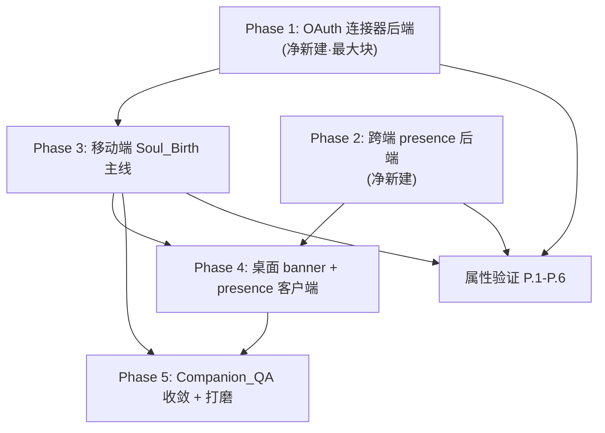

# Implementation Plan — Soul_Companion_Onboarding(灵魂诞生首跑引导)

> 仓库约束:TypeORM 全局 SnakeNamingStrategy(`@Column` 不写 `name:`);默认中文;两条 chat 路径(`/openclaw/proxy/:id/stream` 与 `/claude/chat`)如有改动需同步;
> 移动端 node_modules 在 Windows 检出为桩,本地仅 `getDiagnostics` 验证,tsc/jest/构建走 WSL 或 CI(APK build-apk step 18 为真实 JS bundle/Kotlin 门禁);
> 后端改动按 SSH 部署流程(`git pull` + `npm run build` + `migration:run` + `pm2 restart agentrix-backend`)。所有任务仅涉及编码活动。
> 原则:**最大化复用现有底座**(provision/QR/relay/TTS/定位/Aeon/连接器框架/浮球/AXP/流式对话),净新建仅三处(OAuth 链路、presence、soulBirthStore 五段编排)。

## Overview

本实施计划把 `soul-companion-onboarding` 设计拆为 5 个 Phase + 属性验证任务,按依赖排序:**先后端 OAuth 与 presence 净新建底座(Phase 1/2)**,再移动端编排主线(Phase 3),桌面端衔接(Phase 4),最后全端问答收敛与打磨(Phase 5)。每个任务标注对应 `requirements.md` 需求编号与 `design.md` 章节。

## Task Dependency Graph



```json
{
  "waves": [
    { "wave": 1, "tasks": ["1.1", "1.2", "1.3", "1.4", "1.5"], "rationale": "OAuth 连接器后端净新建,first_task 段依赖它" },
    { "wave": 2, "tasks": ["2.1", "2.2", "2.3"], "rationale": "跨端 presence 后端净新建,可与 wave 1 并行" },
    { "wave": 3, "tasks": ["3.1", "3.2", "3.3", "3.4", "3.5", "3.6"], "rationale": "移动端 Soul_Birth 五段编排,依赖 wave 1 OAuth" },
    { "wave": 4, "tasks": ["4.1", "4.2", "4.3"], "rationale": "桌面 banner + presence 客户端,依赖 wave 2/3" },
    { "wave": 5, "tasks": ["5.1", "5.2", "5.3"], "rationale": "Companion_QA 全端收敛与打磨,依赖前序" },
    { "wave": 6, "tasks": ["P.1", "P.2", "P.3", "P.4", "P.5", "P.6"], "rationale": "属性验证,依赖核心落地" }
  ]
}
```

## Tasks

## Phase 1 — 日历/邮箱 OAuth 连接器后端(净新建·最大块)

- [x] 1.1 OAuthToken 实体 + 令牌加密器 + 迁移
  - 新建 `backend/src/modules/connector/oauth-token.entity.ts`(`connector_oauth_tokens`,字段 userId/connectorId/accessTokenEnc/refreshTokenEnc/expiresAt/scope,`@Unique(['userId','connectorId'])`,SnakeNamingStrategy 不写 `name:`)
  - 新建 `TokenCipher`(Node `crypto` AES-256-GCM,密钥取 `CONNECTOR_TOKEN_KEY` 环境变量;密钥缺失则启动报错)
  - 新建迁移 `backend/src/migrations/` 建表
  - _Requirements: 6.2, 6.8_
  - _Design: §5.2_

- [x] 1.2 ConnectorOAuthService(授权/回调/刷新/撤销)
  - 新建 `backend/src/modules/connector/connector-oauth.service.ts`:`authorizeUrl`(带签名 state 防 CSRF)、`handleCallback`(code 换 token、加密落库、成功才建 UserConnector)、`getValidAccessToken`(临期用 refresh token 自动刷新回写)、`revoke`(provider revoke + 删 token + 卸 UserConnector)
  - 取消/回调 error 路径抛描述性错误,不创建任何安装记录
  - 令牌/邮件正文/日程标题不写日志
  - _Requirements: 6.2, 6.3, 6.4, 6.7, 6.8_
  - _Design: §5.3_

- [x] 1.3 ConnectorService.install 增加 oauth 分支 + 目录条目
  - 在 `connector.service.ts` install 增加 `oauth` 分支:返回 `{ needsOAuth: true, authorizeUrl }`,真正落库在 handleCallback
  - `connector-catalog.ts` 新增并置 live:`google-calendar`、`gmail`(authKind oauth);国内/不可达兜底 `system-calendar`(none,端侧)、`imap-email`(api_key);`ConnectorDef` 补 `oauthProvider?`/`oauthScopes?`
  - 兜底选项不限定地域(R6.6)
  - _Requirements: 6.1, 6.6_
  - _Design: §5.1, §5.3_

- [x] 1.4 CalendarEmailReadout 服务
  - 新建 `backend/src/modules/connector/calendar-email-readout.service.ts`:`todaySummary` 按 connector 分流——google-calendar(events.list 今日计数)、gmail(messages.list q=is:unread 计数)、imap-email(IMAP SEARCH UNSEEN)、system-calendar(端侧回传计数)
  - 仅请求只读 scope(calendar.readonly / gmail.readonly|metadata)
  - _Requirements: 4.3, 6.5_
  - _Design: §5.4_

- [x] 1.5 控制器端点扩展 + 共享类型
  - `connector.controller.ts` 新增:`GET /v1/connectors/:id/oauth/authorize-url`、`GET /v1/connectors/oauth/callback`(`@Public()` + state 校验)、`GET /v1/connectors/:id/readout`、`DELETE /v1/connectors/:id/oauth`
  - `shared/types/connector.ts`:`ConnectorInstallResult` 加 `needsOAuth?`/`authorizeUrl?`;新增 `CalendarEmailReadout` 类型
  - _Requirements: 4.3, 6.2, 6.4, 6.5, 6.7_
  - _Design: §5.5, Data Models_

## Phase 2 — 跨端 presence 后端(净新建)

- [x] 2.1 PresenceService(内存 TTL + 心跳 + sweep)
  - 新建 `backend/src/modules/presence/presence.service.ts`:`report(userId,instanceId,device,ttl)` 刷新心跳;`query(userId,instanceId)` 返回各端在线列表 + lastSeen;`sweep()`(每 5s)超时即标离线并推送
  - 离线判定:心跳超 ttl 立即离线,与是否重连无关;不删配对关系
  - 参考 `geo-presence.service.ts` 内存 TTL map 先例
  - _Requirements: 8.1, 8.2, 8.3, 8.5, 8.6_
  - _Design: §7.1_

- [x] 2.2 Presence 端点 + WS 推送
  - 新建 `presence.controller.ts`:`POST /v1/presence/heartbeat`、`GET /v1/presence/:instanceId`(均 JwtAuthGuard,仅限本人 instance)
  - 状态变化经现有 openclaw WS 网关广播 `presence:update`,确保 5s 内同步
  - 注册 `presence.module.ts` 进 AppModule
  - _Requirements: 8.1, 8.4, 8.5_
  - _Design: §7.2_

- [x] 2.3 移动端 presence 客户端封装 + 共享类型
  - 新建 `src/services/presence.service.ts`:`heartbeat(device='mobile')` 周期上报、`subscribePresence` 订阅 `presence:update`、`queryPresence`
  - `shared/types/` 新增 `DevicePresence`
  - _Requirements: 8.2, 8.5_
  - _Design: §7.3, Data Models_

## Phase 3 — 移动端 Soul_Birth 五段主线编排

- [x] 3.1 soulBirthStore(改造 firstRunStore,移除 battle)
  - 新建 `src/stores/soulBirthStore.ts`(MMKV key `agentrix-soul-birth-v1`,zustand persist):5 步枚举 `birth/first_words/first_task/connect_desktop/settle_aeon`、`completed`、`terminated`、`instanceId/petName/avatarId`、`complete`(幂等推进)、`skip`、`reset`、`recompute`(ExternalFacts 回填)、`currentStep`(第一个未完成)
  - 退役 `firstRunStore.ts` 与 `FirstRunQuestBanner.tsx`(移除 WorldHubScreen 挂载点);删除 `WorldInteractiveBattleScreen` 的 `markFirstRunStep('battle')` 调用
  - _Requirements: 1.1, 1.2, 1.3, 1.4, 1.5, 1.6, 1.7, 1.8_
  - _Design: §2.1, §2.2_

- [x] 3.2 SoulBirthHost 挂载层
  - 新建 `src/components/onboarding/SoulBirthHost.tsx`,挂载在 `RootNavigator` 已登录(Main)分支之上(覆盖层);游客/未登录/terminated 不渲染(C3/C9)
  - 挂载时拉取 ExternalFacts(`getMyInstances`/relay 历史/`claimPlot` 历史)调 `recompute` 实现 skip-earlier-if-later-done
  - 按 currentStep 渲染对应 Step 组件;统一「跳过」入口调 `skip()`
  - _Requirements: 1.1, 1.2, 1.4, 1.5_
  - _Design: §2.2_

- [x] 3.3 birth 段:起名 + 选皮肤 + provision 苏醒动画
  - 新建 `BirthStep`:名称输入 + 皮肤选择器(默认灵狐 clan A)+「换一个/拍一张/去市场选」三按钮(复用 CloudDeployScreen 要素)
  - 确认调 `provisionCloudAgent`,显示「灵魂正在苏醒」覆盖动画(隐藏原始进度条);轮询 `getInstanceById`
  - 重试/超时:90s 硬超时 + 提前失败即时提示,保留 name/avatar;动画持续至结束态出现
  - 成功 → 存 instanceId/petName/avatarId,`complete('birth')`
  - _Requirements: 2.1, 2.2, 2.3, 2.4, 2.5, 2.6, 2.7, 2.8_
  - _Design: §2.3, §3.1_

- [x] 3.4 first_words 段:Birth_Moment_Line + 天气 + TTS
  - 新建 `src/services/onboarding/birthMomentLine.ts`(纯本地时间模板,无网络)
  - 新建 `src/services/onboarding/ttsSpeaker.ts`(包裹 `/voice/tts`:模板音频缓存 + 同会话限频 + 失败降级文字气泡,播放复用 AudioQueuePlayer)
  - Weather_Garnish:定位 + 天气各 5s 超时即静默跳过,不阻塞/延迟主句;主句先播,天气句追加
  - 播报结束/跳过 → `complete('first_words')`
  - _Requirements: 3.1, 3.2, 3.3, 3.4, 3.5, 3.6, 3.7, 3.8_
  - _Design: §3.2, §3.3, §3.4_

- [x] 3.5 first_task 段:OAuth 授权 + 日程/未读播报 + AXP
  - 新建 `FirstTaskStep`:连接日历/邮箱/跳过;选 OAuth → 走 §5.3 安装流程(打开授权页 → 回调)
  - 成功 → 调 `/readout` → `ttsSpeaker.speak` 念日程/未读 → `rewardFromReality`(固定 idempotencyKey,一次性)+ 钱包跳动可视化(失败不影响发放)→ `complete('first_task')`
  - 拒绝/跳过 → 跳过 readout 直接 `complete`;授权/读取失败 → 可重试或可跳过,不阻塞主线
  - _Requirements: 4.1, 4.2, 4.3, 4.4, 4.5, 4.6, 4.7_
  - _Design: §4_

- [x] 3.6 settle_aeon 段:圈地 + 附近的人 + 签到
  - 新建 `SettleAeonStep`:引导 `claimPlot` 首次圈地 → 展示附近的人 → 签到发 15 AXP(复用 Aeon 既有能力)
  - 仅显式签到才发 15 AXP(仅圈地不发);可视化失败不影响发放
  - 无定位允许跳过不报错;圈地或跳过 → `complete('settle_aeon')` → 结束主线进常规主界面
  - _Requirements: 5.1, 5.2, 5.3, 5.4, 5.5, 5.6_
  - _Design: §2 (settle_aeon 段)_

## Phase 4 — 桌面端常驻 banner + presence 客户端

- [x] 4.1 移动端 DesktopBanner 常驻组件
  - 新建 `src/components/desktop/DesktopBanner.tsx`(主界面常驻):展开介绍多端特色(手机陪伴/查询/管日程,桌面 Computer Use/vibe coding,同一灵魂同一记忆)
  - 首连(未配对过):「连接电脑」→ 复用 `createBindSession` 展示 QR + 下载链接 + 配对步骤,轮询 `pollBindSession` 至 confirmed
  - 已配对过:跳过首连引导,直接展示跨端状态/管理入口(presence 设备列表)
  - _Requirements: 7.1, 7.2, 7.3, 7.3a, 7.4_
  - _Design: §6_

- [x] 4.2 connect_desktop 段与 banner 衔接
  - `ConnectDesktopStep` 内嵌 DesktopBanner 首连引导;「稍后连接」→ `complete('connect_desktop')` 且 banner 主界面继续常驻
  - 首次配对成功 → 建立 presence + `complete('connect_desktop')`
  - _Requirements: 7.5, 7.6, 7.7, 8.1_
  - _Design: §6, §7.3_

- [x] 4.3 桌面端启动自动检测 + presence 上报
  - 桌面端(Tauri)启动检测 relay(`getRelayStatus`)并 `heartbeat(device='desktop')`(打开桌面端自动确认跨端在线)
  - 失网 → 心跳停 → 后端 sweep ttl 超时即离线;重连恢复在线
  - 移动端订阅 `presence:update` 更新设备列表 UI
  - _Requirements: 8.2, 8.3, 8.4, 8.6_
  - _Design: §7.3_

## Phase 5 — 全端随时问答陪伴 Companion_QA 收敛 + 打磨

- [x] 5.1 移动端 Companion_QA 上下文 + 流式
  - 复用 `CompanionLayer`/`GlobalFloatingBall`(常驻浮球,屏内悬浮唤起不离开场景);tap → `companionSheets.conversation.present()`
  - 提问走 `streamAgentChat(instanceId, message, ctx)`,payload 携带 `{ device, scene/route, 当前任务态 }` 使回答上下文感知;TTS 播报复用 ttsSpeaker 限频
  - _Requirements: 9.1, 9.2, 9.3, 9.4, 9.7, 9.8_
  - _Design: §8_

- [x] 5.2 桌面端 Companion_QA 面板 + 跨端记忆
  - 桌面 `ChatPanelImpl` 作为常驻问答面板,同 instanceId 走同一后端会话/记忆
  - 验证记忆按 instanceId 单点存取:任一端新增记忆对其它端后续对话可见(后端单一记忆源,无端本地分叉)
  - _Requirements: 9.1, 9.5, 9.6_
  - _Design: §8_

- [x] 5.3 端到端打磨与降级核对
  - 全链路核对 Error Handling 表所有降级路径(provision 超时/TTS 失败/定位天气跳过/OAuth 失败/Google 不可达兜底/钱包动画失败/无定位跳过/presence 超时)均不卡主线
  - 「重看引导」入口接 `reset()`;`getDiagnostics` 清扫涉及文件
  - _Requirements: 1.7, 3.4, 3.6, 4.6, 5.4, 6.6, 8.6_
  - _Design: Error Handling, §2.1_

## 属性验证任务(Correctness Properties)

- [x] P.1 验证主线必达与第一句话纯本地
  - 单测 `soulBirthStore`/`birthMomentLine`:外部依赖全失败时 currentStep 仍可推进/终止;buildBirthMomentLine 无网络调用、固定时间稳定输出
  - _Requirements: 1.5, 3.1, 3.2, 3.4, 3.6_
  - _Design: Correctness Properties 1, 2_

- [x] P.2 验证步骤单调推进 + 指针解析 + skip-earlier
  - 单测:complete 幂等不回退、reset 整体清空、currentStep=第一个未完成、recompute 回填后跳过较早已达成项、续跑
  - _Requirements: 1.1, 1.2, 1.3, 1.4, 1.6, 1.7_
  - _Design: Correctness Properties 3, 4, 5_

- [x] P.3 验证 OAuth 令牌不外泄 + 原子性
  - 单测 `ConnectorOAuthService`/`TokenCipher`:加解密往返、密文不含明文、日志无令牌;取消/error 不建安装记录
  - _Requirements: 6.4, 6.8_
  - _Design: Correctness Properties 6, 7_

- [x] P.4 验证 AXP 幂等
  - 单测:first_task/settle_aeon 用固定 idempotencyKey 重复触发不重复发放;可视化失败不回滚已发金额
  - _Requirements: 4.4, 5.3_
  - _Design: Correctness Property 8_

- [x] P.5 验证 presence 离线即时
  - 单测 `PresenceService`:sweep 超 ttl 立即离线(不论是否重连)、不删配对、重连恢复在线
  - _Requirements: 8.6_
  - _Design: Correctness Property 9_

- [x] P.6 验证 TTS 节流 + 跨端单一记忆源
  - 单测 `ttsSpeaker` 缓存命中不重复请求、同会话限频丢弃/降级;集成核对 Companion_QA 记忆按 instanceId 跨端可见
  - _Requirements: 3.8, 9.5, 9.6, 9.8_
  - _Design: Correctness Properties 10, 11_

## Notes

- **验证手段**:Windows 检出无法本地跑 tsc/jest/Metro;每个任务完成后用 `getDiagnostics` 扫涉及文件,JSX/bundle/Kotlin 真实门禁走 CI(APK build-apk step 18)。后端单测在 WSL/CI 跑 jest。
- **后端部署**:Phase 1/2 涉及新表(`connector_oauth_tokens`),按 SSH 流程 `git pull` + `npm run build` + `migration:run` + `pm2 restart agentrix-backend`(生产 `47.130.176.148`)。
- **环境变量**:Phase 1 需配置 `CONNECTOR_TOKEN_KEY`(32 字节)以及 Google OAuth `client_id`/`client_secret`/`redirect_uri`;缺失时连接器降级到兜底(system-calendar/imap-email)。
- **复用优先**:除净新建三块(OAuth 链路 / presence / soulBirthStore),其余一律复用既有能力,不重写 provision/QR/relay/TTS/定位/Aeon/浮球/AXP/流式对话。
- **不破坏现状**:退役 `firstRunStore`/`FirstRunQuestBanner` 时确认无其它引用残留;两条 chat 路径如被 Companion_QA 上下文 payload 触及需同步。
- **执行约束**:所有任务仅为编码活动,逐个执行、完成即勾选,前一 Phase 的净新建底座不就绪不进入依赖它的 Phase。
