# Agentrix 端侧对话/语音时序与流程图汇总

> 更新：2026-04-20 · 适用于 build142 及以后版本。
> 涵盖桌面端（Tauri）、移动端（RN/Expo）在 **本地模型 / 云端模型 / 混合模式** 下
> 的文本、图片、语音/音频、视频四类输入的实际流程。
>
> 所有图表使用 Mermaid，GitHub / VS Code / Notion 均可直接渲染。

---

## 0. 全局架构方框图

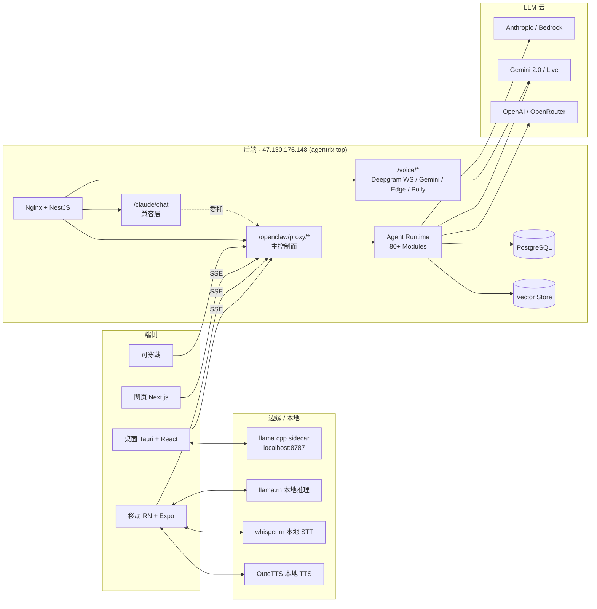

---

## 1. 桌面端 · 文本对话（云端模式）

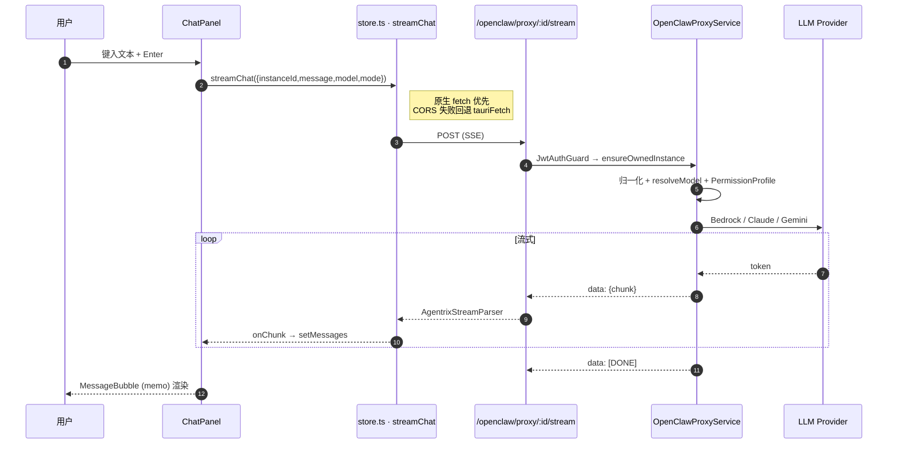

---

## 2. 桌面端 · 文本（本地模型 llama.cpp sidecar）

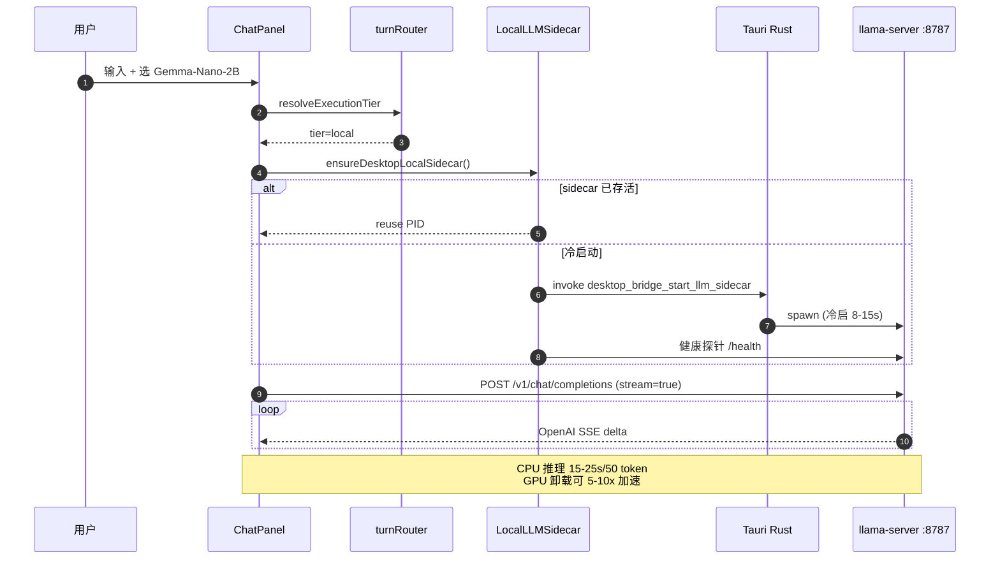

---

## 3. 桌面端 · 混合模式决策

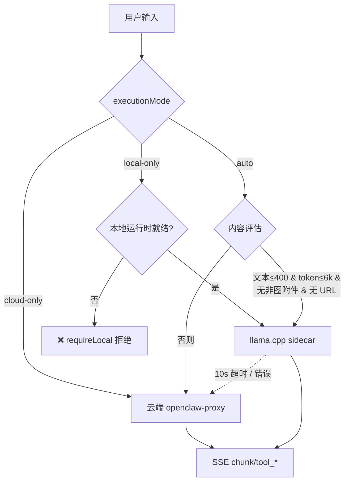

---

## 4. 桌面端 · 图片 / 视频 / 文件附件

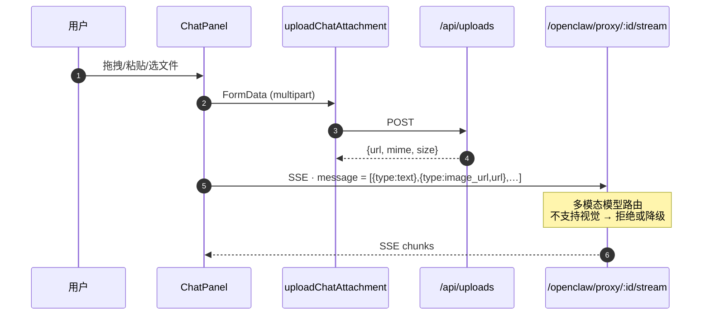

---

## 5. 桌面端 · 语音（按住说话 · 当前实现）

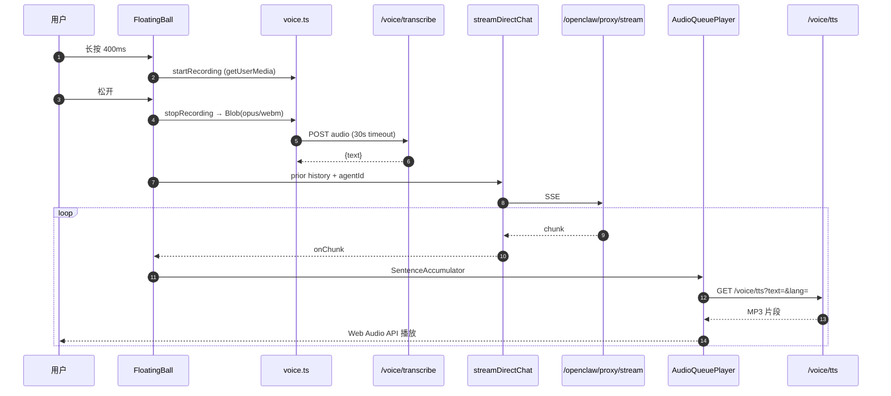

**已知瓶颈**
- 批量 STT（单 Blob 发送）无流式；30s 超时 → 感知延迟 2-5s
- `SentenceAccumulator` 等句号才刷 → 首句 TTS 延迟
- 本地模型下整体延迟叠加到 40s+

---

## 6. 桌面端 · 全双工语音（目标架构 · 切换 realtime）

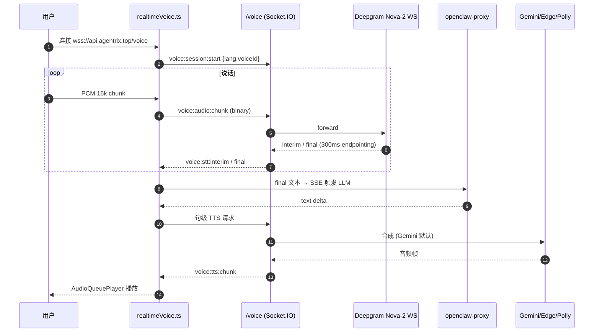

---

## 7. 移动端 · 文本 + 附件（云端 SSE）

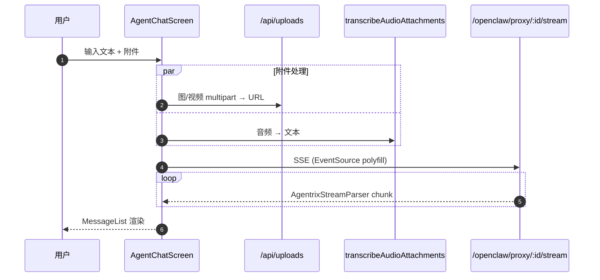

---

## 8. 移动端 · 本地模型（llama.rn · Gemma-3n）

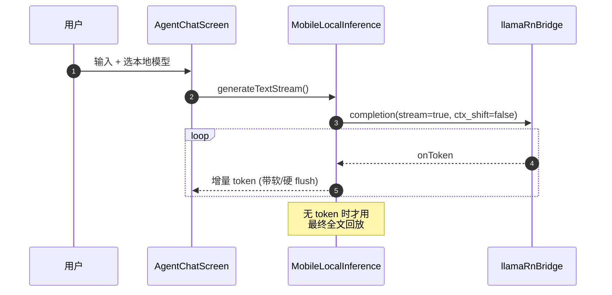

---

## 9. 移动端 · 按住说话（三分支路由）

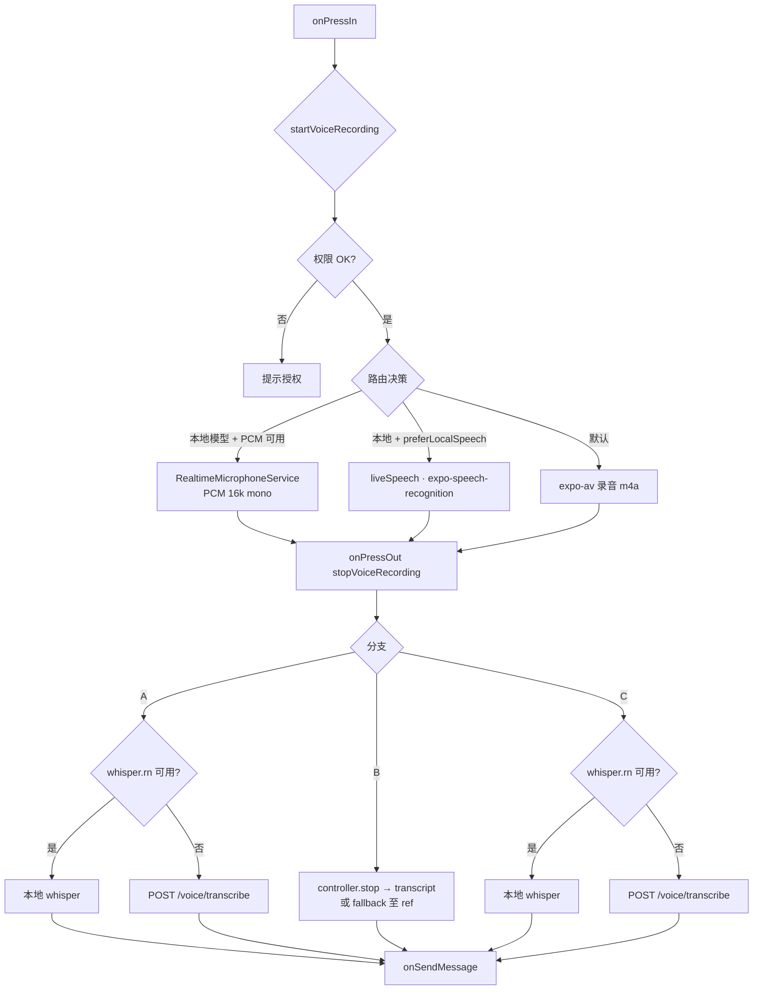

---

## 10. 移动端 · 全双工实时通话

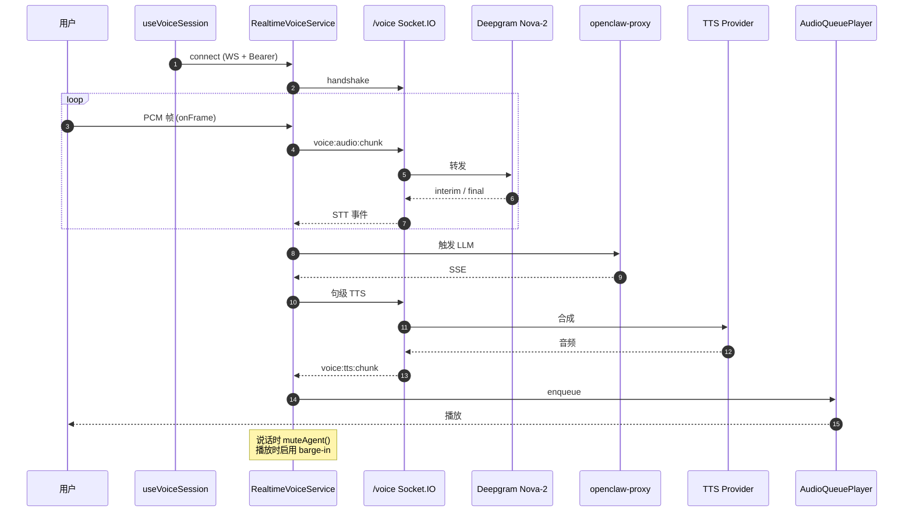

---

## 11. 移动端 · 图片 / 音频 / 视频附件

```mermaid
flowchart TD
    IN[用户选文件] --> T{MIME}
    T -->|image| IM{模型支持视觉?}
    IM -->|是| UP1[multipart → /uploads]
    IM -->|否 & 本地| BL[🚫 block]
    IM -->|否 & 云| UP1
    UP1 --> MSG[SSE content 数组]
    T -->|audio| AU{本地 whisper?}
    AU -->|是| LW[localWhisper.transcribe]
    AU -->|否| CS[/voice/transcribe]
    LW --> TXT[拼接为文本 turn]
    CS --> TXT
    T -->|video| VV{多模态 LLM?}
    VV -->|是| UP2[上传 + 取帧+音轨]
    VV -->|否| BL2[🚫 不支持]
    UP2 --> MSG
    MSG --> OP[openclaw-proxy]
    TXT --> OP
```

---

## 12. Agent 架构方框图

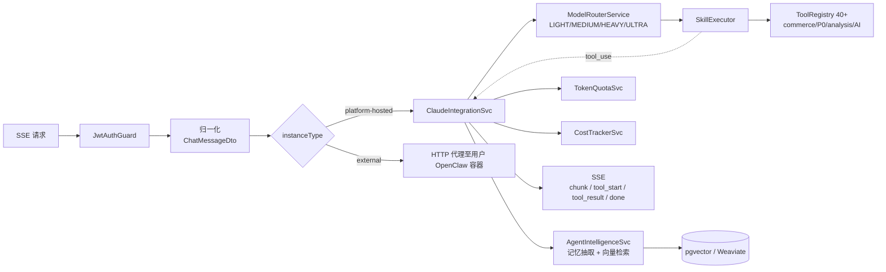

---

## 13. 语音提供商决策

```mermaid
flowchart TD
    TTS[TTS 请求] --> P{VOICE_TTS_PROVIDER}
    P -->|gemini (默认)| G[Gemini TTS]
    P -->|edge| E{从 AWS SG 可达?}
    E -->|是| EE[Edge TTS]
    E -->|否| G
    P -->|polly| PL[AWS Polly · $4/1M chars]
    G -.失败.-> EE
    EE -.失败.-> PL

    STT[STT 请求] --> S0{Gemini STT 可用?}
    S0 -->|是 & 允许| GS[Gemini STT · 免费]
    S0 -->|否| S1{VOICE_STT_ORDER}
    S1 --> AWS[AWS Transcribe Streaming · 主]
    AWS -.失败.-> GR[Groq Whisper Turbo]
    GR -.失败.-> OAI[OpenAI Whisper]
    subgraph Realtime
      DG[Deepgram Nova-2 WS]
    end
    STT2[/voice WS/] --> DG
```

---

## 14. 已知瓶颈总表

| 类别 | 位置 | 现象 | 计划 |
|---|---|---|---|
| 桌面卡顿 | `FloatingBall.tsx` backdrop-filter × 4 | 核显空闲占用 30% | ✅ 已删除 |
| 桌面重渲 | `ChatPanel.tsx` useAuthStore() 全量订阅 | 输入/token 刷新均全树刷 | ✅ selector 拆分 |
| 桌面 TTS 延迟 | `AudioQueuePlayer.ts` 按句缓冲 | 首句延迟 ≥ 句长 | 🔧 早刷 (逗号/10字) |
| 桌面本地推理 | `localLLM.ts` | 40s 冷启 + CPU 推理 | 🔧 sidecar 常驻 + GPU 卸载 |
| 桌面 STT | `voice.ts` 批量 30s | 无流式 interim | 🔧 切 realtime-voice gateway |
| 移动无法通话 | `realtimeVoice.service.ts` | WS 静默失败 | 🔧 连接失败显式报错 |
| 移动按住无转录 | `useVoiceSession.ts` 路径 A | 权限/设备占用 0 字节 | 🔧 权限预检 + 设备占用提示 |
| 后端 Edge TTS | AWS SG 网络策略 | 被墙 | 🟡 默认 Gemini TTS |
| 后端 Groq 401 | env key 无效 | 回退 AWS | 🟡 更新 key |

---

## 15. 测试矩阵（E2E 回归）

| 端 | 模式 | 文本 | 图片 | 音频附件 | 视频 | 按住说话 | 全双工 |
|---|---|---|---|---|---|---|---|
| 桌面 | 云端 | ✅ | ✅ | ✅ | 🟡 | 🔧 | 🔧 |
| 桌面 | 本地 | 🔧 | — | — | — | 🔧 | — |
| 桌面 | 混合 | 🔧 | ✅ | ✅ | 🟡 | 🔧 | 🔧 |
| 移动 | 云端 | ✅ | ✅ | ✅ | 🟡 | 🔧 | 🔧 |
| 移动 | 本地 | ✅ | 🟡 | 🟡 | — | 🔧 | — |
| 移动 | 混合 | ✅ | ✅ | ✅ | 🟡 | 🔧 | 🔧 |

图例：✅ 稳定 · 🟡 部分 · 🔧 本次修复周期内 · — 不支持
