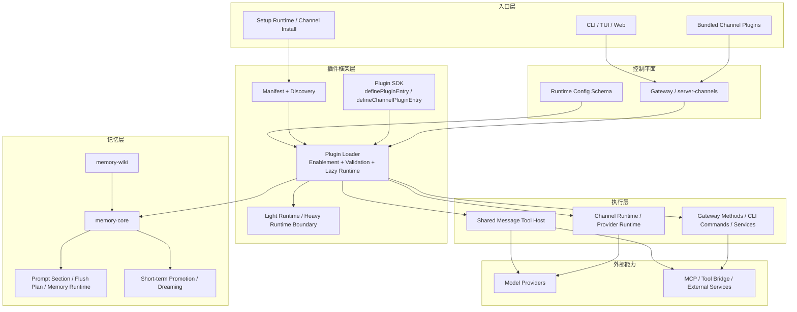

# OpenClaw 4.5 与 Agentrix 当前 Agent Framework 审计

更新时间：2026-04-08

## 1. 文档目的

这份文档回答两个问题：

1. OpenClaw 4.5 开源框架当前到底由哪些模块组成，它们分别负责什么，靠什么机制运行。
2. Agentrix 当前后端中的 agent framework 到底已经跑到哪一步，哪些模块已经在真实链路里工作，哪些还只是部分接线。

本文不是产品宣传稿，而是基于代码与公开仓库结构做的架构审计。

证据来源分为两类：

- OpenClaw 部分：基于公开仓库 openclaw/openclaw 的 v2026.4.5 标签族与同期公开主线结构，重点参考 docs/plugins/architecture.md、docs/plugins/sdk-overview.md、src/plugins/loader.ts、src/gateway/server-channels.ts、extensions/memory-core、extensions/memory-wiki。
- Agentrix 部分：基于 backend/src/app.module.ts 的真实模块接线、当前仓库中的模块实现、以及 2026-04-08 的后端运行态审计结果。

状态口径：

- 已运行：已接入真实控制器、聊天热路径、定时/事件链路或生产可用 API。
- 部分运行：已经接线并有实现，但不在主热路径，或关键链路尚未闭环。
- 待补齐：代码中没有足够运行证据，或者只有概念占位。

## 2. 执行摘要

先给结论：

- OpenClaw 4.5 的核心不是单个聊天接口，而是一个以 Gateway 为控制平面、以 Plugin 为扩展边界、以 Memory Slot 为长期记忆边界、以 Channel Runtime 为多入口边界的 agent framework。
- Agentrix 当前已经不是“只有 UI 的 OpenClaw 外壳”，而是一个已经落地了平台托管、桌面协同、技能市场、支付商业域的产品化运行层。
- Agentrix 当前已经把真实聊天运行时收口到 /openclaw/proxy；/claude/chat 仍保留，但只作为兼容壳转发到默认 OpenClaw runtime，不再单独维护第二套主执行链路。
- 当前审计的 17 个核心 agent 模块里，9 个已运行，8 个部分运行，0 个可判定为纯占位模块。
- 与 OpenClaw 4.5 相比，Agentrix 当前真正的强项不在 Plugin contract，而在多设备协同、平台托管和 commerce-first 产品域；真正的缺口在 plugin-owned runtime、统一 session control plane、memory slot 全量能力、ACP bridge 与 runtime compat。

## 3. OpenClaw 4.5 框架图



## 4. OpenClaw 4.5 模块说明

| 模块 | 主要功能 | 实现原理 | 运行机制 |
|---|---|---|---|
| Gateway / server-channels | 统一控制平面，承接客户端、channel、账户快照、运行时助手 | Gateway 把 channel 统一抽象成 ChannelId、AccountSnapshot、GatewayMethod 等可调度接口 | 启动时构建 channel manager，运行中根据配置和 account 状态管理 channel runtime、重试与 backoff |
| Plugin Manifest + Discovery | 发现插件、读取 manifest、识别 kind/channels/providers/modelSupport | 优先读 openclaw.plugin.json 与 bundle manifest，用静态元数据决定可见性和基础校验 | 插件发现发生在 runtime 加载前，先决定“能不能看见”，再决定“是否真正激活” |
| Plugin Loader | 完成启用、禁用、slot 选择、lazy runtime 绑定 | loadOpenClawPlugins 先处理 enablement，再按需要用 jiti 懒加载运行时代码 | 启动阶段可走 validate 或 full 模式；只有需要的插件 runtime 会被真正 import |
| Plugin SDK Entry | 为普通插件、channel 插件、provider 插件提供统一注册入口 | definePluginEntry 负责通用插件，defineChannelPluginEntry 额外接入 channel 能力和全量注册面 | 插件 register(api) 后把工具、gateway method、memory capability、CLI descriptor 等注册进中心 registry |
| Shared Message Tool Host | 让不同 channel 共享同一个 message tool，而不是每个 channel 各造一套发送工具 | core 负责 session/thread bookkeeping，channel 插件只负责动作发现与最终执行 | 模型调用共享 message host，具体发送/编辑/反应能力由 channel plugin 动态描述并落地 |
| Light Runtime / Heavy Runtime Boundary | 降低插件冷启动成本，把 setup/light surface 与 full runtime 分离 | runtime-web-channel-plugin 等模块缓存 light/heavy runtime，并在真正需要时再装载 heavy module | 配置、探测、setup 阶段尽量只触发 light runtime；实际发送、媒体处理时再进 heavy runtime |
| Runtime Config Schema | 把所有插件 manifest 里的 schema 汇总成最终配置界面和校验面 | loadManifestRegistry 读取 manifest registry，再 buildConfigSchema 生成 channels/plugins 的组合 schema | 启动前可读出当前配置 schema，供 gateway、setup UI、doctor、CLI 使用 |
| memory-core | 提供默认长期记忆插件，包括 recall、索引、runtime、embedding provider | 通过 memory kind 插件向框架注册 promptBuilder、flushPlanResolver、memoryRuntime、publicArtifacts、memory_search/memory_get 工具 | 运行中由 memory slot 独占启用；聊天时参与 prompt supplement，后台可做 index、search、promote、rem-harness |
| Flush Plan / Prompt Section | 把“何时压缩对话进记忆”和“如何提示模型使用记忆”标准化 | MemoryPluginCapability 中显式暴露 promptBuilder 与 flushPlanResolver | 聊天环路可通过 resolveMemoryFlushPlan 决定刷写时机，通过 buildPromptSection 构造记忆使用说明 |
| Dreaming / Promotion | 做短期回忆提升、梦境式重组、长期记忆晋升 | memory-core 内部用短期 promotion、dreaming phases、narrative 组合 | 可通过命令或托管 cron 执行，周期性整理 recall 候选并提升到长期记忆层 |
| memory-wiki | 构建结构化知识图谱和 Obsidian 友好的 wiki 语义层 | 作为 memory 邻接插件，注册 prompt supplement、corpus supplement、gateway methods 与 wiki 工具 | 运行中既能为 memory_search 提供 wiki corpus，也能通过 wiki.status/wiki.search/wiki.apply 等 gateway method 被外部访问 |
| Gateway Methods / CLI / Service Surface | 让插件不仅能加工具，也能加 gateway RPC、CLI 子命令和服务端方法 | OpenClawPluginApi 同时支持 registerGatewayMethod、registerCli、registerTool 等多种表面 | 一部分能力面向聊天 runtime，一部分面向 CLI/operator，一部分面向远程 gateway 客户端 |

### OpenClaw 4.5 的运行特征

- 它是 plugin-first，不是 feature-first。功能大多先被定义为插件 contract，再通过 runtime 消费。
- 它是 gateway-centered，不是单 endpoint centered。真正的中心是 gateway registry，而不是某一个 REST 路径。
- 它是 memory-slot based。记忆不是普通工具，而是带独占 slot、flush plan、prompt supplement、runtime 的框架级能力。
- 它强调 lazy runtime。manifest、setup、light runtime、heavy runtime 被刻意分层，以控制启动成本和边界耦合。

## 5. Agentrix 当前框架图

```mermaid
flowchart TB
  subgraph C[客户端与入口]
    Web[Web]
    Desktop[Desktop]
    Mobile[Mobile]
    Pair[Desktop Pair / OAuth]
    ChatA[/claude/chat compat]
    ChatB[/openclaw/proxy chat/stream]
    SyncApi[/desktop-sync/*]
  end

  subgraph R[运行时核心]
    Proxy[openclaw-proxy]
    Context[agent-context / memory recall]
    Intelligence[agent-intelligence]
    ToolReg[tool-registry]
    Skill[skill]
    Provider[ai-provider]
    Query[query-engine]
    Router[llm-router]
    Cost[cost-tracker]
    Dreaming[dreaming]
    Wiki[memory-wiki]
  end

  subgraph O[组织与身份层]
    Team[agent-team]
    Unified[unified-agent]
    Orch[agent-orchestration]
    Presence[agent-presence]
  end

  subgraph D[跨设备与实例层]
    Sync[desktop-sync]
    Connection[openclaw-connection]
    Bridge[openclaw-bridge]
    Instance[OpenClawInstance]
  end

  subgraph P[持久化]
    DB1[(openclaw_instances)]
    DB2[(agent_accounts / user_agents / teams)]
    DB3[(agent_memory / wiki pages)]
    DB4[(desktop sessions / approvals / tasks)]
  end

  Web --> ChatA
  Desktop --> ChatA
  Mobile --> ChatA
  Desktop --> ChatB
  Mobile --> ChatB
  Pair --> SyncApi

  ChatA --> ChatB
  ChatB --> Proxy
  SyncApi --> Sync

  Proxy --> Context
  Proxy --> Intelligence
  Proxy --> ToolReg
  Proxy --> Skill
  Proxy --> Provider
  Proxy --> Query
  Proxy --> Router
  Proxy --> Cost
  Proxy --> Orch
  Proxy --> Instance

  Team --> DB2
  Unified --> DB2
  Presence --> DB2
  Context --> DB3
  Intelligence --> DB3
  Dreaming --> DB3
  Wiki --> DB3
  Sync --> DB4
  Connection --> Instance
  Bridge --> Instance
  Instance --> DB1
```

## 6. Agentrix 17 个核心模块审计

### 6.1 已运行模块

| 模块 | 功能 | 实现原理 | 运行机制 | 状态 |
|---|---|---|---|---|
| openclaw-proxy | Agentrix 当前最核心的聊天与实例代理入口 | 通过控制器暴露 /openclaw/proxy/:id/stream 和 /openclaw/proxy/:id/chat，把平台托管聊天、工具调用、计划模式、实例代理统一进一个服务 | 真实聊天热路径会经过它，内部串联 LLM、hooks、tool registry、desktop bridge、plan mode | 已运行 |
| openclaw-bridge | 远程实例与本地实例之间的技能、配置、快照同步 | 通过 bridge service 发起实例探测、skill snapshot、迁移同步，主要依赖 HTTP/Axios 双向同步 | 在 onboarding 和 team provisioning 等流程中实际被调用，但更偏“同步面”而不是“实时执行面” | 已运行 |
| openclaw-connection | 本地设备和外部实例的连接、异步中继 | 通过 child_process、本地 agent 启动、Telegram bot relay 等方式穿透不可直连环境 | 模块初始化时会处理待执行命令，适合 async task handoff，不适合强实时低延迟控制 | 已运行 |
| desktop-sync | 桌面设备心跳、审批、共享工作区、任务协同 | 通过多实体建模设备在线、共享 workspace、命令审批和任务状态，并发出 desktop-sync events | 提供 heartbeat、task CRUD、approval response 等接口，真实用于桌面协同 | 已运行 |
| agent-intelligence | plan mode、自动记忆提炼、标题、压缩与会话增强 | 在服务内部维护 active plan、步骤、审批状态、memory extract 结果 | 被 openclaw-proxy 真实调用，参与 plan 接受、拒绝、执行与压缩 | 已运行 |
| skill | 技能市场、技能执行、审批、导入、工作流组合 | 模块内有 executor、marketplace、approval、OpenAPI importer、dynamic adapter、workflow composer 等完整子服务 | 预置技能会在启动时自动装载；聊天过程中由 executor 承接工具执行 | 已运行 |
| ai-provider | 用户自定义模型提供商与 API key 管理 | 对 provider config、apiKey、baseUrl、region 等做存储与解密，支持多厂商 | 聊天热路径会解析用户 provider 配置，Copilot token exchange 也在这里处理 | 已运行 |
| tool-registry | 中心工具注册表与多模型 schema 适配层 | 通过装饰器自动发现工具，再统一生成 OpenAI、Bedrock、Claude 等不同 schema | 启动后自动建表，聊天时被用来生成 tool schemas 并驱动工具调用 | 已运行 |
| agent-presence | 统一 agent 身份、timeline、channel binding、memory scope | 基于 UserAgent、ConversationEvent、AgentSharePolicy、AgentMemory 等实体统一管理 agent presence | 有完整 CRUD 与 timeline 查询接口，已被移动端和 Web 端身份层实际消费 | 已运行 |

### 6.2 部分运行模块

| 模块 | 功能 | 实现原理 | 运行机制 | 状态 |
|---|---|---|---|---|
| agent-team | 团队模板、角色定义、团队型 agent 预配置 | 根据 role definition 批量创建 AgentAccount 与账户侧实体 | 已能 provision 团队，但实例绑定仍延后到后续选择或融合流程 | 部分运行 |
| unified-agent | 合并 OpenClawInstance、AgentAccount、UserAgent 的统一视图 | 在服务层手工 join 多张身份表，输出统一 agent 描述对象 | 已被内部消费，但没有独立 controller，且仍依赖 metadata 软连接 | 部分运行 |
| agent-orchestration | 子代理生成、协调与 mailbox | 定义 SubAgentHandle、CoordinateConfig，并在 proxy 中作为内部编排助手被调用 | 已接入代理热路径，但没有完整 async worker 与独立操作面 | 部分运行 |
| llm-router | 按任务复杂度在 LOCAL/LIGHT/MEDIUM/HEAVY/ULTRA 之间路由模型 | 维护 tier 判定与模型价格/能力元数据 | 逻辑已经实现，但聊天主链路尚未把它作为实际决策器 | 部分运行 |
| query-engine | 状态化 query loop、工具执行、结构化 SSE | 定义 ConversationState、StreamEvent、ToolExecutor、compaction 等统一执行模型 | 核心逻辑存在，但当前主要热路径仍由 openclaw-proxy 主导，未完全替代为唯一核心 | 部分运行 |
| cost-tracker | Token 使用成本估算与价格表 | 内置模型价格表并根据 token usage 计算费用 | 已可计算，但主聊天链路里尚未形成完整持久化记账闭环 | 部分运行 |
| dreaming | 记忆整理、跨记忆模式发现、梦境式压缩 | 以 DreamingSession、MemorySlotService 等为基础组织后台整理过程 | 模块已接线，但当前没有足够证据表明生产中存在持续运行的后台 dreaming job | 部分运行 |
| memory-wiki | 结构化 wiki 知识层与 wikilink 图谱 | 通过 WikiPage、wikilink 提取、图节点构造，建立可查询知识层 | 代码实现存在，但未见公共 controller 或主聊天热路径消费证据 | 部分运行 |

### 6.3 当前运行态汇总

| 分类 | 数量 | 模块 |
|---|---:|---|
| 已运行 | 9 | openclaw-proxy、openclaw-bridge、openclaw-connection、desktop-sync、agent-intelligence、skill、ai-provider、tool-registry、agent-presence |
| 部分运行 | 8 | agent-team、unified-agent、agent-orchestration、llm-router、query-engine、cost-tracker、dreaming、memory-wiki |
| 待补齐 | 0 | 本次 17 个已审计核心模块中，没有可判定为纯占位但无任何实现的模块 |

## 7. Agentrix 当前运行机制解读

### 7.1 真正的核心链路

Agentrix 当前真正的框架中心不是单独的 UserAgent，也不是旧式的普通聊天控制器，而是下面这条链：

1. 入口可以来自 /claude/chat 兼容路径，也可以直接来自 /openclaw/proxy/chat 或 /openclaw/proxy/stream。
2. 无论入口来自哪里，真实执行都会先收口到 openclaw-proxy。
3. openclaw-proxy 负责决定会话应走平台托管还是外部实例。
4. 进入 agent-intelligence、tool-registry、skill、ai-provider 等子系统。
5. 在需要时借助 query-engine 的事件/工具循环能力。
6. 结果再通过 desktop-sync、approval、移动端或桌面端输出。

这意味着 Agentrix 已经具备“框架化”的骨架，而且主聊天运行时已经开始向单控制平面收口；剩余工作更多是把外围兼容入口和 plugin/memory contract 继续压平。

### 7.2 Agentrix 当前最强的不是插件框架，而是产品层

和 OpenClaw 4.5 相比，Agentrix 现在最强的三块是：

- 平台托管：OpenClawInstance、账号体系、默认实例自愈、桌面配对、社交登录接续。
- 多端协同：desktop-sync、设备存在感、审批、共享工作区、异步回传。
- 商业域：skill marketplace、wallet、payment、commerce、task economy。

换句话说，Agentrix 的差异化更像“OpenClaw framework 上方的产品化运行层”。

## 8. OpenClaw 4.5 与 Agentrix 的一一对应

| OpenClaw 4.5 框架模块 | Agentrix 当前对应物 | 当前判断 |
|---|---|---|
| Gateway / 单控制平面 | /openclaw/proxy 主入口 + /claude/chat compat shim | 主运行时已收口，兼容入口仍保留 |
| Plugin discovery + loader | skill + tool-registry + plugin 模块 | 有中心注册，但 plugin-owned runtime 还不完整 |
| Channel plugin runtime | openclaw-connection + openclaw-bridge + desktop/mobile 接入 | 有跨设备接入，但不是统一 channel plugin contract |
| Memory slot / memory-core | agent-context + agent_memory + agent-intelligence | 基础 recall 已有，但没有完整 slot + flush plan contract |
| memory-wiki | memory-wiki 模块 | 已接线但未形成真实主路径 |
| Dreaming | dreaming 模块 | 已接线但后台 job 运行证据不足 |
| Shared message/tool host | tool-registry + skill executor + query-engine | 已具雏形，但目前仍由 openclaw-proxy 主控 |
| Runtime config schema | Nest 模块装配 + 平台配置体系 | 有配置体系，但不是 OpenClaw 风格 manifest schema 汇总 |
| ACP bridge | 当前缺少对应主模块 | 明显缺口 |
| Runtime compat / doctor | 当前缺少对应主模块 | 明显缺口 |

## 9. 现阶段真正的差距在哪里

不是所有差距都同等重要。当前最关键的差距只有四类：

1. 控制平面还需要继续做“兼容面压平”，但主 runtime 已经统一。
  现在 /claude/chat 已被降级为兼容入口，真实执行统一收口到 /openclaw/proxy；剩余差距主要在把更多外围入口、文档和 contract 表达彻底对齐到同一控制面。

2. Plugin contract 不够深。
   Agentrix 已有 skill 和 tool registry，但插件还不能像 OpenClaw 4.5 一样自然拥有自己的 channel、tool、gateway method、memory capability、runtime seam。

3. Memory contract 不够完整。
   Agentrix 已有 recall、compaction、memory extract，但缺少 OpenClaw 4.5 那种显式 memory slot、flush plan、prompt supplement、runtime、dreaming 的完整 contract。

4. ACP 与 runtime compat 仍缺位。
   这两个不是“锦上添花”，而是后续如果要继续向 OpenClaw 兼容框架收口时必须补齐的边界能力。

## 10. 总结

如果用一句话概括：

OpenClaw 4.5 是一个以 Gateway、Plugin、Memory Slot 为核心 contract 的通用 agent framework；Agentrix 当前则是在这个方向上已经走出相当深度的产品化变体，尤其强化了平台托管、多设备协同和 commerce-first 业务域。

Agentrix 现在并不是“没做起来”，相反，它已经有大量真实运行模块；但它也还不是完全意义上的 OpenClaw 4.5 风格统一运行时。当前最合理的路线不是重复造一套新内核，而是把现有已运行能力继续向统一 control plane、统一 plugin contract、统一 memory contract 收口。

这也是为什么本次审计结论不是“推翻重做”，而是“继续收敛”。