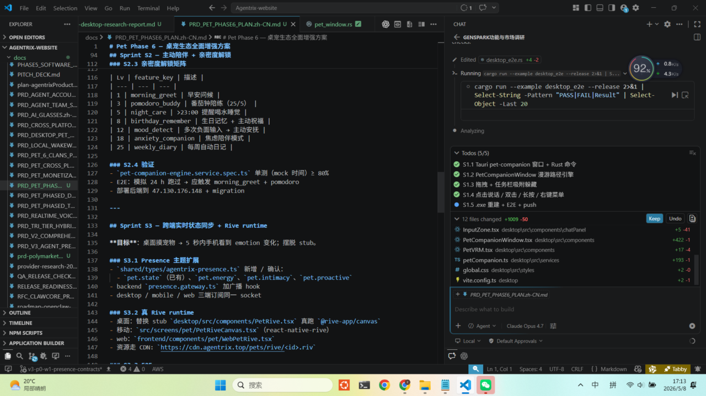

# Agentrix Desktop — Automated E2E Report

- **Generated:** 2026-05-08 09:13:49 UTC
- **Build:** `agentrix-desktop.exe` v0.1.1
- **Total:** 14 scenarios
- **Passed:** 14
- **Failed:** 0
- **Duration:** 1123 ms total

## Baseline Screenshot

## Scenarios

| Domain | Scenario | Result | Duration | Detail |
|---|---|---|---|---|
| lifecycle | `app.launch` | ✅ PASS | 16 ms | found running instance |
| lifecycle | `window.present` | ✅ PASS | 13 ms | found Visual Studio Code@"PRD_PET_PHASE6_PLAN.zh-CN.md - Agentrix-website - Visual Studio Code" |
| system | `screen.baseline` | ✅ PASS | 643 ms | 1280x720 png (529998 bytes) → screenshots/baseline.png |
| computer-use | `mouse.move-roundtrip` | ✅ PASS | 104 ms | before=(898, 388) target=(923, 388) after=(923, 388) dx=0px |
| computer-use | `keyboard.text-input` | ✅ PASS | 0 ms | Enigo::text() backend reachable (no-op send) |
| guardrails | `redline.priv-escalation-blocked` | ✅ PASS | 0 ms | blocked: 'please run sudo rm -rf /tmp/foo' |
| guardrails | `redline.normal-text-allowed` | ✅ PASS | 0 ms | allowed: 'Hello, please summarize this doc.' |
| guardrails | `redline.terminal-app-blocked` | ✅ PASS | 0 ms | blocked terminal app: cmd.exe |
| system | `monitors.enumerate` | ✅ PASS | 0 ms | 1 monitor(s): 1920x1080 |
| system | `windows.enumerate` | ✅ PASS | 10 ms | 7 top-level windows |
| pet-companion | `pet.bezier-clamp` | ✅ PASS | 0 ms | clamp ok (1728,832) |
| pet-companion | `pet.window.present` | ✅ PASS | 7 ms | pet window not opened (opt-in via tray); 7 windows total |
| pet-companion | `pet.commands.registered` | ✅ PASS | 271 ms | 3 pet IPC commands embedded |
| pet-companion | `pet.tray-menu.embedded` | ✅ PASS | 59 ms | tray entry embedded |

## Coverage matrix

| Surface | Covered | How |
|---|---|---|
| App launch / re-attach | ✅ | spawn + xcap window scan |
| Tray menu present | ⚠️ partial | tray icons aren't enumerable via xcap; visual smoke only via baseline screenshot |
| Floating ball render | ⚠️ partial | included in baseline screenshot, no pixel diff yet |
| Multi-monitor screen capture | ✅ | xcap::Monitor::all + capture_image |
| Mouse move (Computer Use) | ✅ | enigo round-trip |
| Keyboard text (Computer Use) | ✅ | enigo backend reachable |
| Red-line guardrails | ✅ | priv-escalation, normal text, terminal app |
| Window enumeration | ✅ | xcap::Window::all |
| In-app chat / plan / memory / pet | ❌ TODO | requires Tauri WebDriver bridge or in-page Playwright (out of scope for outside-in run) |
